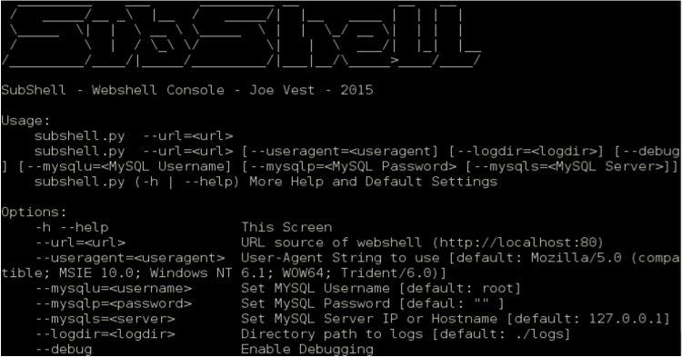
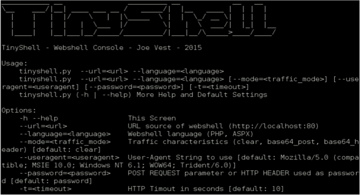
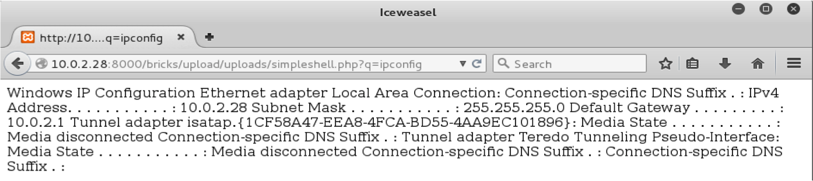

Web applications continue to be a valuable door for attackers to use to gain remote access to a network. If a web application is compromised, the webserver itself can be used to enable a command and control (C2) channel and provide a platform for post exploitation. The use of web shells is a common method to provide this capability. Like other malicious code, security protections must be considered and understood to bypass their protections. Specific Tools, tactics and procedures (TTPs) must be designed into a web shell to minimize detection. Many current web shells have no protection against common network security defenses.

<!-- truncate -->
This post discusses the use of web shells for post exploitation and as a covert channel for use during penetration tests or red team engagements, how to minimize the risk of detection and the pros and cons of using web-shells.

I developed two web shell frameworks – SubShell and TinyShell

Before I discuss these web shells, here is a quick overview of a web shell.

### What is a web shell?

Server side code that acts as a non-interactive 'shell', remote administration tool or control panel allowing a user to issue remote commands to be executed by a web server.

Simply put, a web shell is a page that runs commands directly on the web server on behalf of the requestor.

### Why use a web shell?

- Web Applications can be a valuable door into a network and are often your first network foothold outside of social engineering
- Provides remote code execution into a network
- On demand. No regular polling or beaconing makes C2 harder to detect

### How do you use a web shell?

- Exploit or compromise a web server, i.e.:
  - Application flaw
  - File upload flaw
  - RFI (remote file include)
  - Direct access to application source

#### **Example**

Here is a simple PHP shell that uses the system function to execute OS commands.

```php
<?php echo(system($_GET["q"])); ?>
```

When an HTTP GET is sent to the URL hosting this page, the parameter "q" will be executed by the web server's OS.



---

## **Subshell and Tiny Shell**

### Why were these frameworks built?

These projects were born out of the need for a consolidated webshell framework. There are numerous available, but I wanted to create a framework that supports numerous web languages, common features, and a common backend.

These projects use the principle of hiding in plain sight with a goal of minimizing attention. Like numerous malicious tools, they are easy for defenders to find when they begin to look. These projects are designed to be stealthy by minimizing the triggering of defenses such as IDS, Firewall, AV etc.

When performing penetration tests or red team engagements, "[hacking to get caught](https://www.youtube.com/watch?v=Mke74a9guNk)" can be part of the test. Sometimes you want to be caught, sometimes you don't. A good security tester can control when or how their tools are exposed.

### How have I been caught?

These are some mistakes or tools choices that allowed me to get caught by blue/defense teams. Most of the time this was caused by using untested tools that were not designed to be stealthy.

- Default User Agent strings
- OS commands in HTTP logs via GET requests
- Clear text OS commands moving across the wire
- Clear text binaries moving across the wire (MZ header)
- Doing too much too quick

### How does SubShell or Tinyshell help control getting caught?

- POST requests to minimize data written web logs
- Encoding and traffic blending to help avoid clear text detection
- Console interface forces a slow down when issuing commands. Use of a webshell should be deliberate and focused. Numerous connections may attract attention.
- Customization of user-agent to help blend in.
- Valid 404 errors displayed when attempting to connect to shell without 'authentication' information.

### Initial design considerations

- Minimize attention
- Single command and control server
- Multiple version
- Safe to use without SSL
- Requests/Responses must be obfuscated or encrypted
- File browsing
- File Upload/Download
- Command execution
- HTTP POST Requests used for C2 traffic
- Invalid request render a valid 404 response

For more details, check out the tools in the MINIS repository or watch my Bsides talk on webshells
