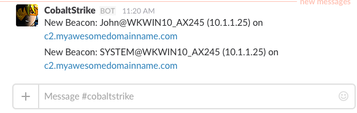
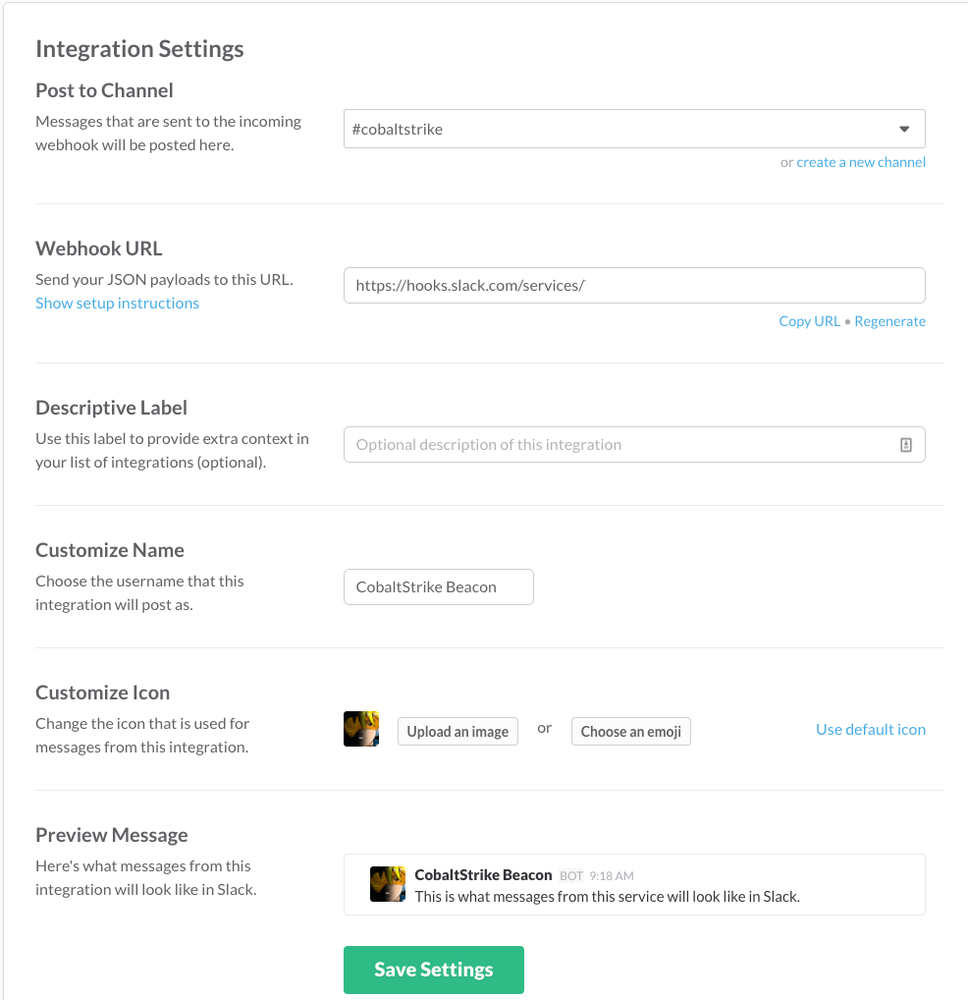

We've seen several great incoming agent/shell notification mechanisms for Metasploit and Empire recently and the utility of being notified when new shells appear is without question. This is especially true when conducting phishing and social engineering style attacks or while waiting for a persistence mechanism to trigger. A recent example is [SlackShellBot](https://www.swordshield.com/2016/11/slackshellbot/) by @Ne0nd0g. We really like it, but often use Cobalt Strike heavily and thus need another notification method for CS.

<!-- truncate -->
Enter Aggressor script. This is just one quick example of performing Slack notifications for Cobalt Strike using Aggressor. If you're a regular CS user, we highly recommend [spending some time](https://www.cobaltstrike.com/aggressor-script/index.html) with Aggressor scripting to step up your automation and workflows. @armitagehacker has a [comprehensive post ](http://blog.cobaltstrike.com/2016/07/06/gettin-down-with-aggressor-script/)of Aggressor resources that is a great starting point.



New Beacon Slack Notifications

**Requirements:**

- This method relies on a custom web-hook just as SlackShellBot. Refer the [official documentation](https://api.slack.com/incoming-webhooks) if you need a quick guide on creating one
- A Python module for Slack integrations called "slackweb"
  - Using pip: `pip install slackweb`

### Step 1: Create your Custom Slack Webhook



Slack Custom Webhook Configuration

### Step 2: Create a Python script to post the Slack notifications

This Python code is a basic example of using the slackweb module to submit a Slack text notification to our custom webhook. Don't forget to make the script executable!

```
#! /usr/bin/env python
# slacknotifcation.py

import argparse
import slackweb
import socket

parser = argparse.ArgumentParser(description='beacon info')
parser.add_argument('--computername')
parser.add_argument('--internalip')
parser.add_argument('--username')

hostname = socket.gethostname()

args = parser.parse_args()

slackUrl = "https://hooks.slack.com/services/..."
computername = args.computername
internalip = args.internalip
username = args.username

slack = slackweb.Slack(url=slackUrl)
message = "New Beacon: {}@{} ({}) on {}".format(username,computername,internalip,hostname)
slack.notify(text=message)
```

###

### Step 3: Create the Aggressor script

Save the following code as a new Aggressor script. You can customize the desired information and format of the Slack notification here. The format provided in this example is "New Beacon: USERNAME@HOSTNAME (IP ADDRESS) on C2SERVERHOSTNAME"

:::note
You could also modify this Aggressor script to use curl and eliminate the need for Python and an additional module entirely! However, Python allows us to quickly grab the hostname of the C2 server and easily track what assessment/campaign the incoming beacons are associated with.
:::

```
# Issue initial commands upon new beacon checkin
# slacknotification.cna

on beacon_initial {
    println("Initial Beacon Checkin: " . $1 . " PID: " . beacon_info($1,"pid"));
    local('$internalIP $computerName $userName');
    $internalIP = replace(beacon_info($1,"internal")," ","_");
    $computerName = replace(beacon_info($1,"computer")," ","_");
    $userName = replace(beacon_info($1,"user")," ","_");
    $cmd = '/path/to/slacknotification.py --computername ' . $computerName . " --internalip " . $internalIP . " --username " . $userName;

    println("Sending Slack Notification: " . $cmd);
    exec($cmd);
    }
}
```

### Step 4: Load the Aggressor script into Cobalt Strike

The Aggressor script can be [loaded](https://www.cobaltstrike.com/help-scripting) into CS via the GUI or headless mode. Once loaded, fire off some beacons and watch the notifications come in!

Hopefully this post is useful and let us know if you have additional ideas or improvements!
