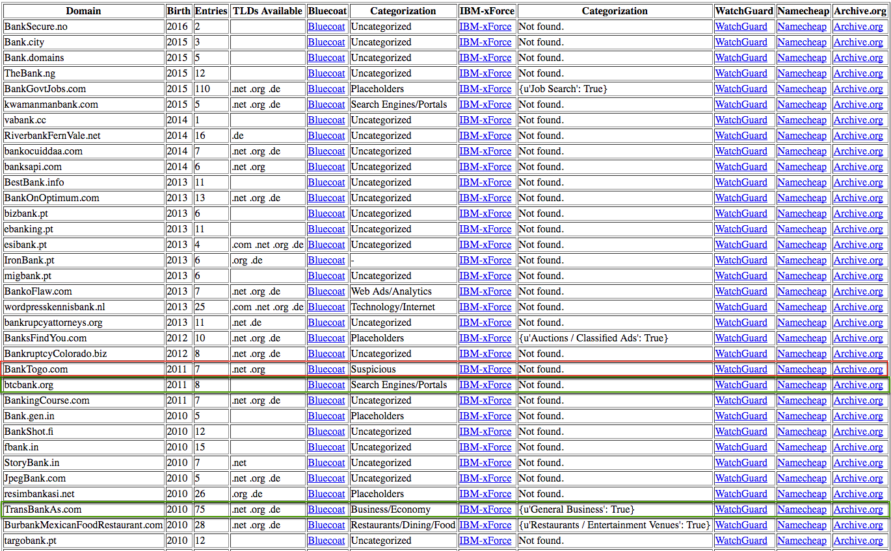
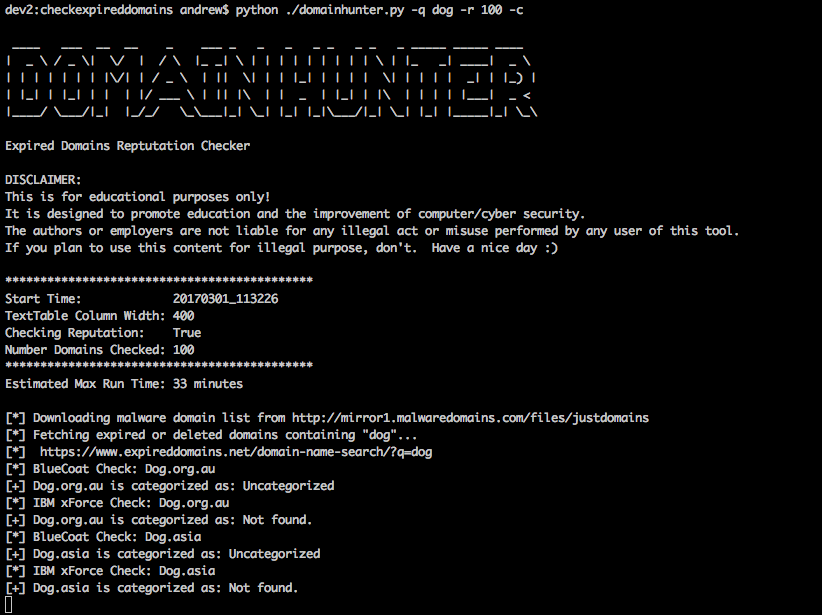

## Overview

Domain name selection is an important aspect of preparation for phishing scenarios, penetration tests, and especially Red Team engagements. It is increasingly common to be faced with web filtering in a network based on domain reputation and categorization. Often traffic to very new and/or uncategorized domains is completely blocked by such appliances – stopping your phishing payload or C2 agent in their tracks. There's been a lot of talk about Domain Fronting and High Trust Redirectors in the security community lately to deal with this same issue, but that's an extra layer of configuration and complexity that's probably not necessary for every engagement. _See [MDSec – Domain Fronting via Cloudfront Alternate Domains](https://www.mdsec.co.uk/2017/02/domain-fronting-via-cloudfront-alternate-domains/) and Raphael Mudge's [blog](https://blog.cobaltstrike.com/2017/02/06/high-reputation-redirectors-and-domain-fronting/) for more on those techniques._

<!-- truncate -->
Domains that were once used for benign purposes and already properly categorized often expire or are deleted, but they can be purchased again for only a few dollars. Such domains enable a team to bypass reputation based web filters and network egress restrictions for phishing and C2 related tasks. Enter [ExpiredDomains.net](https://www.expireddomains.net/) – the expired domain names search engine. This is a great resource for pentesters and red teamers looking for a quick "fast-food menu" of available domains when they don't want or have the luxury of time to develop a catalog of domains, maintain web servers, and create "legit content" for proper categorization, only to see them quickly burned on an op. There's certainly a case for maintaining some domains over time, but again you probably don't want to use them for quick one or two week engagements.

Thus we started working on DomainHunter (https://github.com/threatexpress/domainhunter) back in September 2016, a small script that would take advantage of Expireddomains.net listings and cross them with known reputation sources to generate a list of potential domains for upcoming engagements. Mr-Un1k0d3r created [CatMyFish](https://github.com/Mr-Un1k0d3r/CatMyFish) which also leverages the Expireddomains.net listing and is worth a look. DomainHunter was written to quickly query the Expireddomains.net search engine for expired/deleted domains and automatically remove any already reported by Malwaredomains.com. It then optionally queries for domain reputation against services like Blue Coat WebPulse Site Review.

**Note:** Most domain reputation services such as Blue Coat employ CAPTCHA protections that must be avoided by slowing down scripted requests, thus if running over large query sets we recommend executing as a scheduled/cron job and have new options e-mailed to you periodically. Additionally, after around 150 requests to Blue Coat, you'll start receiving the captcha even with the intentionally slow timing programmed into DomainHunter.

Let us ([@joevest](https://twitter.com/joevest) [@andrewchiles](https://twitter.com/andrewchiles)) know on Twitter if you find the tool useful or have recommendations and improvements!

---



_**Example HTML Report Output for "bank"**_

[Source on Github](https://github.com/threatexpress/domainhunter)

## DomainHunter

### Features

- Retrieves specified number of recently expired and deleted domains (.com, .net, .org primarily)
- Retrieves available domains based on keyword search
- Performs reputation checks against the Blue Coat Site Review service
- Sorts results by domain age (if known)
- Generates Text-based table and HTML report output with links to reputation sources and associated Archive.org entry

## Usage

Install all necessary Python requirements

```
cd ./domainhunter/ && pip install -r requirements.txt
```

List available options

```
python ./domainhunter.py -h
usage: domainhunter.py [-h] [-q QUERY] [-c] [-r MAXRESULTS] [-w MAXWIDTH]

Checks expired domains, bluecoat categorization, and Archive.org history to
determine good candidates for C2 and phishing domains

optional arguments:
-h, --help show this help message and exit
-q QUERY, --query QUERY
Optional keyword used to refine search results
-c, --check Perform slow reputation checks
-r MAXRESULTS, --maxresults MAXRESULTS
Number of results to return when querying latest
expired/deleted domains (min. 100)
-w MAXWIDTH, --maxwidth MAXWIDTH
Width of text table
```

Execute a basic query with reputation checks

```
python ./domainhunter.py -q dogs -c
```



_**Example Console Output with Reputation Checking**_

## Additional Resources
