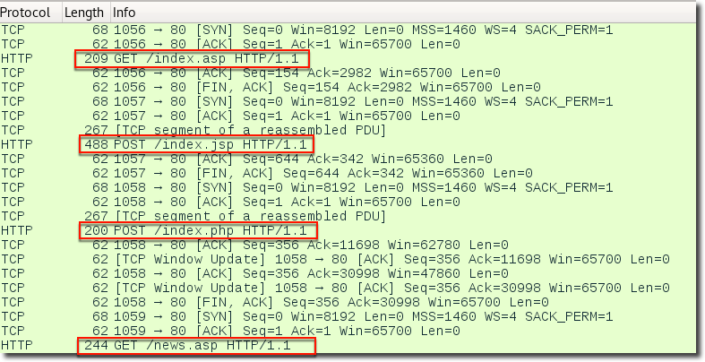
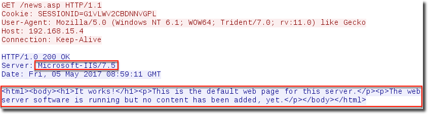
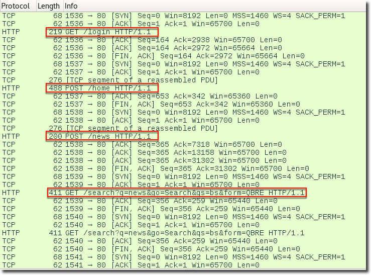
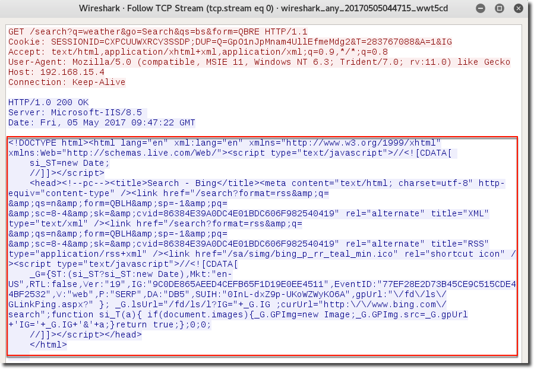

## Overview

This post is intended as a follow-on to Jeff Dimmock's [detailed write-up](https://github.com/bluscreenofjeff/bluscreenofjeff.github.io/blob/master/_posts/2017-03-01-how-to-make-communication-profiles-for-empire.md) on creating communication profiles for [Empire](https://github.com/EmpireProject/Empire). Empire 1.6's “DefaultProfile” setting for modifying C2 indicators doesn't directly allow modification of the server-side parameters. When faced with an experienced group of defenders, default C2 server indicators can quickly reveal your infrastructure. HTTPS listeners with valid certificates can certainly hinder traffic monitoring, but isn't a silver bullet.

<!-- truncate -->
A good example of identifying Empire infrastructure is detailed in a [Chokepoint post](http://www.chokepoint.net/2017/04/hunting-red-team-empire-c2.html) using Shodan and Scans.io scan data. They included a Python script that idenfitied an Empire server based on a cookie handling error, but the bug was fixed in a subsequent [commit](https://github.com/EmpireProject/Empire/commit/01f530700e21fd8d3eb7381864459dea85ba44fb). This is just another reason to protect your infrastructure from probing using redirectors with Apache mod_rewrite as Jeff also [explained](https://bluescreenofjeff.com/2016-06-28-cobalt-strike-http-c2-redirectors-with-apache-mod_rewrite/). Nevertheless, the steps for identifying a default configured Empire server are fairly trivial and we wanted to be able to change them! We explored the ability to modify Empire 1.6 server side C2 indicators without breaking agent functionality.

#### Server Parameters

- Staging URIs
  - Default: index.asp,index.jsp,index.php

:::note
How likely are asp, jsp, and php to exist together on the same web server? Payload staging is typically easy to identify no matter the C2 technology, but we can improve on Empire's default staging behavior.
:::

 **Empire – Default Staging URIs**

- Server technology
  - Default: Microsoft-IIS/7.5
- Server content
  - Default: “It works!”



---

## Empire Modification

We'll continue Jeff's original example by porting some of the additional server side parameters in the [Bing Search](https://github.com/bluscreenofjeff/MalleableC2Profiles/blob/master/bingsearch_getonly.profile) Malleable C2 profile to Empire.

:::note
The following modifications are applicable to Empire 1.6. Empire 2.0 utilizes Flask and some of these settings will need to be changed elsewhere if you're running 2.0 beta.
:::

### Modifying the staging URIs and Server header

The easiest way to update the server's default behavior is through the setup*database.py script. \_Disclaimer:* These steps assume you're building up your server from scratch and aren't running an active engagement. You could also update the sqlite database directly if you don't want to blow away your existing database.

**First, remove your existing Empire database**

```
rm /data/empire.db
```

**Next, edit /setup/setup_database.py**

```
# /setup/setup_database.py

# the resource requested by the initial launcher
#STAGE0_URI = "index.asp"
STAGE0_URI = "login"

# the resource used by the RSA key post
#STAGE1_URI = "index.jsp"
STAGE1_URI = "home"

# the resource used by the sysinfo checkin that returns the agent.ps1
#STAGE2_URI = "index.php"
STAGE2_URI = "news"

# the default delay (in seconds) for agent callback
# DEFAULT_DELAY = 5
DEFAULT_DELAY = 10

# the default jitter (0.0-1.0) to apply to the callback delay
#DEFAULT_JITTER = 0.0
DEFAULT_JITTER = 0.5

# the default traffic profile to use for agent communications
# format -> requestUris|user_agent|additionalHeaders
#DEFAULT_PROFILE = "/admin/get.php,/news.asp,/login/process.jsp|Mozilla/5.0 (Windows NT 6.1; WOW64; Trident/7.0; rv:11.0) like Gecko"
DEFAULT_PROFILE = "/search?q=news&go=Search&qs=bs&form=QBRE,/search?q=weather&go=Search&qs=bs&form=QBRE,/search?q=movie%20tickets&go=Search&qs=bs&form=QBRE,/search?q=unit%20conversion&go=Search&qs=bs&form=QBRE|Mozilla/5.0 (compatible, MSIE 11, Windows NT 6.3; Trident/7.0; rv:11.0) like Gecko|Accept:text/html,application/xhtml+xml,application/xml;q=0.9,*/*;q=0.8|Cookie:DUP=Q=GpO1nJpMnam4UllEfmeMdg2&T=283767088&A=1&IG"

# the server version to appear as
#SERVER_VERSION = "Microsoft-IIS/7.5"
SERVER_VERSION = "Microsoft-IIS/8.5"
```

**Finally, setup the new database and restart Empire**

```
./setup/setup_database.py
./empire
```

#### Results

Notice we now have new staging URI's that don't stick out quite as much and the new client communication profile is also in use. The staging request length's don't change however so there is still plenty to signature.

 **Empire – Custom Bing Search Profile w/ Modified Staging URIs**

### Modifying the default page

You can modify the default HTML displayed upon a GET request in lib/common/http.py within the “default_page()” function.

**Edit lib/common/http.py**

```
# lib/common/http.py
"""

HTTP related methods used by Empire.

Includes URI validation/checksums, as well as the base
http server (EmpireServer) and its modified request
handler (RequestHandler).

These are the first places URI requests are processed.

"""

from BaseHTTPServer import BaseHTTPRequestHandler, HTTPServer
from SocketServer import ThreadingMixIn
import BaseHTTPServer, threading, ssl, os, string, random
from pydispatch import dispatcher
import re

# Empire imports
import encryption
import helpers
#TODO: place this in a config
def default_page():
"""
Returns the default page for this server.
"""
# Change the default look and redirect requests to a targeted resource (i.e. Organization portal, website, etc)
#page = "<html><head><meta http-equiv="refresh" content="0; url=http://www.bing.com/search"/></head></html>"

# Return some basic Bing Search content

page = """<!DOCTYPE html><html lang="en" xml:lang="en" xmlns="http://www.w3.org/1999/xhtml" xmlns:Web="http://schemas.live.com/Web/"><script type="text/javascript">//<![CDATA[
    si_ST=new Date;
    //]]></script>
    <head><!--pc--><title>Search - Bing</title><meta content="text/html; charset=utf-8" http-equiv="content-type" /><link href="/search?format=rss&q= &qs=n&form=QBLH&sp=-1&pq= &sc=8-4&sk=&cvid=86384E39A0DC4E01BDC606F982540419" rel="alternate" title="XML" type="text/xml" /><link href="/search?format=rss&q= &qs=n&form=QBLH&sp=-1&pq= &sc=8-4&sk=&cvid=86384E39A0DC4E01BDC606F982540419" rel="alternate" title="RSS" type="application/rss+xml" /><link href="/sa/simg/bing_p_rr_teal_min.ico" rel="shortcut icon" /><script type="text/javascript">//<![CDATA[
    _G={ST:(si_ST?si_ST:new Date),Mkt:"en-US",RTL:false,Ver:"19",IG:"9C0DE865AEED4CEFB65F1D19E0EE4511",EventID:"77EF28E2D73B45CE9C515CDE44BF2532",V:"web",P:"SERP",DA:"DB5",SUIH:"0InL-dxZ9p-UKoWZWyKO6A",gpUrl:"\/fd\/ls\/GLinkPing.aspx?" }; _G.lsUrl="/fd/ls/l?IG="+_G.IG ;curUrl="http:\/\/www.bing.com\/search";function si_T(a){ if(document.images){_G.GPImg=new Image;_G.GPImg.src=_G.gpUrl+'IG='+_G.IG+'&'+a;}return true;};0;0;
    //]]></script></head>
    </html>
"""
return page
```

**Restart Empire with your new server C2 parameters**

`./empire`

#### Results



## Summary

---

The ability to modify the network indicators of your C2 technology is critical for a threat representative engagement. While Empire doesn't expose all desired possibilities with the “DefaultProfile” configuration setting, a little exploration into the source reveals more flexibility. Never be afraid to dive into a tool's source and modify it to suit your needs. There are still many ways to signature this traffic and beaconing activity. However, by implementing these modifications your C2 won't completely match the out-of-the-box Empire look and will raise the bar slightly for the Blue guys ;).
