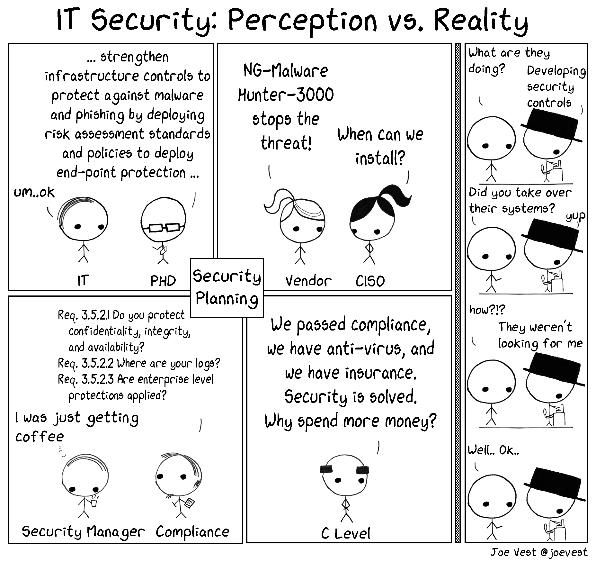
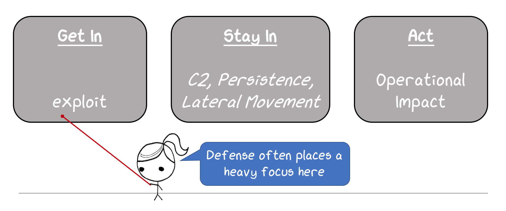
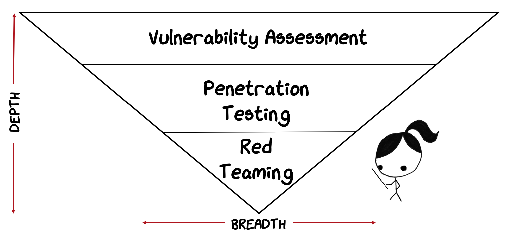
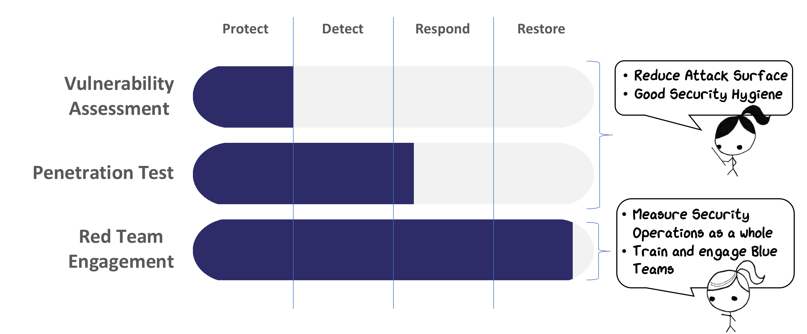
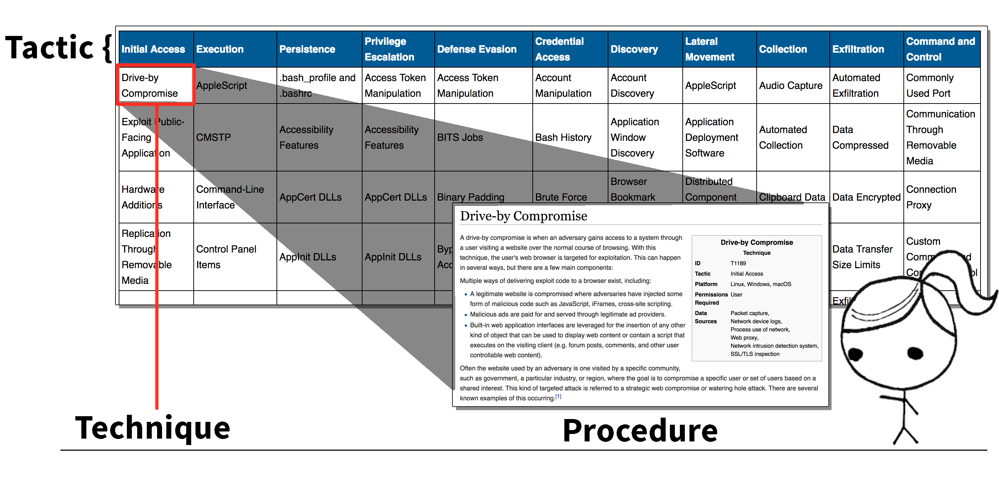

Designing, deploying, and managing a comprehensive security program is not an easy task. An organization's security design is influenced and pressured from multiple, often competing, sources. This includes customers, compliance, management, peers, budget, public opinion, and news. This process is complex and challenging, but an organization is generally able to overcome the pressures and implement what is considered to be a robust security program. An organization is able to please the various parties and, at least on paper, describe a strong security program designed to stop malicious cyber-attacks. Audit and compliance checks pass with a green light. Robust patch management systems are deployed. Vulnerability assessments and penetration tests are conducted. In general, the organization has good security hygiene. These are all great steps in defending a network from attack, but unfortunately, often fall short in achieving the primary goal of preventing, detecting, and responding to real threats. Why? What is missing? The real question to consider is:

<!-- truncate -->
> Are organizations really building security programs designed to address the threat?

This post dives into the shortcomings of security operations design, implementation, and testing and how applying a threat-based security testing program can reduce these gaps to ultimately improve the state of security.

A security program includes many components; staff, policy, tools, management, oversight, incident response to name a few. The program is built by including members of several different divisions. Each contribute their security requirements to ultimately design and build the program. This is a great, but what, or better who, is often missing from this strategy? Has anyone on the team ever seen a bad guy?

## _Is the threat really included in security planning?_

Good intentions by a group of intelligent people do not add up to understanding threats or how they operate. If the goal of security operations is to prevent, detect, respond, and recover to malicious actions, it only makes sense to include the opinions of those who you are defending against.

Unfortunately, the threat or threat perspective is often excluded from security design. This omission can lead to the mitigation or acceptance of risks not fully understood or revealed from traditional security testing and auditing. This can lead to a serious false sense of security. A real threat knows this and uses it to their advantage.

Consider the following. Does a threat know a target has a robust security program? Do threats perform actions that will trigger an alert or get them caught? Are threats still successful? If so, why are threats able to successfully achieve their goals and negatively impact an organization that has a comprehensive security program? To understand this, we need to know what we are defending against.

The security industry uses the term threat, but...

### _What is a threat?_

**Dictionary.com**[1] defines threat as:

1. a declaration of an intention or
   determination to inflict punishment, injury, etc., in retaliation for, or
   conditionally upon, some action or course; menace
2. an indication or warning of probable
   trouble
3. a person or thing that threatens.

**ISO 27001**[2] defines threat as:

1. A potential cause of an incident, that may result in harm of systems and organization

**NIST**[3] defines threat as:

1. Any circumstance or event with the potential to adversely impact organizational operations (including mission, functions, image, or reputation), organizational assets, individuals, other organizations, or the Nation through an information system via unauthorized access, destruction, disclosure, modification of information, and/or denial of service.
   |

To summarize and keep this in context of cybersecurity, a threat is an event that has the potential to adversely impact an organization. Is this what security operations is defending against? A negative event? Perhaps, but consider including the term threat-actor when using threat. A threat-actor is the person or group of people behind an attack. A solid defensive strategy must defend against the intelligent threat-actor bent on causing damage to an organization, and not just a potential event. People are behind cyber-attacks. When the defense considers the tactics, techniques, and procedures (TTPs) of intelligent threat-actors, they begin to truly understand the real threat. Defenders can then implement security defenses that directly impact the ability a threat-actor has to perform negative actions. Shifting security operations from the mindset of "Vulnerable" or "Not Vulnerable" and adopting an approach that focuses on threat actions will significantly improve the ability an organization has to not only prevent but also detect and respond to real threats. This is the beginning of understanding security through the eyes of the threat. Organizations who use threat actions to drive their defensive TTPs can make life very difficult for threat-actors and even protect themselves against unknown or zero-day attacks.

## Why do Threats Succeed?

Many organization's currently use audit and compliance, vulnerability assessments, and penetration testing to evaluate and measure risk to cyber-attack. Why bother with a new threat focused approach?

### _Isn't the identification and mitigation of vulnerabilities enough?_

In order to answer, you must understand how a threat-actor thinks and acts. Remember, a threat is really an intelligent person bent on causing harm. It is NOT an exploit of a vulnerability, NOT a piece of malware, or NOT a phishing attack. These are merely means a threat-actor may choose to use to achieve their end goal. The threat-actor knows the target has a comprehensive security program. A suite of security tools (firewalls, intrusion detection systems, anti-virus, EDR, etc) are deployed with the intent of stopping cyber-attacks. A good threat-actor knows this and will most likely assume patches are deployed and vulnerability assessments and penetration tests are performed. This understanding can significantly change the actions taken by a threat-actor compared to the actions taken by a traditional security tester. Does the threat-actor fire up a port scanner and enumerate an entire network? Does a threat-actor fire up vulnerability scanning tool to find an exploit? Attacks by threat-actors do not always follow the models adopted by traditional security testing. An attack is not scan -> exploit -> profit. An intelligent threat-actor evaluates what a target presents and uses weakness not always discovered through traditional security tests. The threat-actor will take a number of controlled steps to gain access to a target, establish command and control, establish persistence, and ultimately achieve their desired goal. The people charged with defending an organization often ignore or misunderstand the steps taken by a threat-actor. This often leads to focus on prevention, not detection. Defenders who do focus on detection may drown themselves in un-actionable default or vendor generate logs and alerts. Have you ever heard from the defending team "We have too many logs and alerts to respond!"? Why do organizations log what they log? Compliance? In case they are needed? Vendor advice? Organizations are still missing a key piece to all threats; understanding their actions and TTPs.

## Consider this scenario

After evaluating a target network, a threat-actor decides phishing is their chosen method to gain access. A phish is sent to a small number of people. The phish contains an excel attachment with a DDE[4] based attack. An email recipient opens the attachment, malicious code is executed on the target, and command and control (C2) is established. The threat-actor then performs a series of steps that includes situational awareness of current access, enumeration of potential new targets, and lateral movement options to those targets. In this case, the threat finds clear text database credentials on a old test web application backup in a public share. The credentials are used to laterally move to a test database server. Code execution on the database server provides elevated access. The situational awareness cycle repeats. The threat-actor discovers elevated credentials stored in memory on the database server. Credential material is extracted from a Windows domain controller using the stolen elevated database credentials. The threat-actor performs additional situational awareness and enumeration using the new credentials from the domain controller. The intended target is identified and is located on a sensitive file repository. Using the elevated access and C2 channels, the threat-actor achieves their final objective and exfiltrates sensitive data outside the network.

Is this scenario reasonable? Were opportunities presented to detect or prevent the threat? Organizations often blame the end user who clicked the link. What about the actions taken after the initial click? This scenario indicates an organization's entire security model may depend on users not clicking a link in an email. The organization does not intend to hinge all security on a single user, but the actions taken to defend their systems often say otherwise.

### _Why is this scenario successful?_

Organizations often have the wrong mindset to security defense

- Users are blamed for clicking links
- Policies, procedures, and compliance measure security
- Log everything (You never know what you need)
- Patch, patch, patch. Threats only use exploits
- Our security tools will save use

These can be valuable actions that reduce the attack surface, but an intelligent threat-actor knows this. Instead of only focusing on actions that impact the attack surface, organizations need to include a focus on threat TTPs. This does not mean focusing on a specific threat-actor. Whether the threat-actor is script kiddie or an APT, both will execute a series of steps (TTPs) to impact an organization. This is the key. Focusing on defending against TTPs combined with good security practices that reduce the attack surface is the most effective way to directly impact a threat-actor's ability to operate.

## A Threat Will…

To keep it simple, a threat-actor must **Get-In** to establish an initial foothold. This phase is generally quick, but defenders place heavy focus here. They must **Stay-In** by establishing command and control (C2). This is the phase where the threat maintains influence over the target. Actions may include persistence, target identification, lateral movement, and privilege escalation. The Stay-In phase provides the most opportunity to detect or impact a threat, but is often ignored or misunderstood. Finally, the threat-actor will **Act** or perform the actions that reflect why they attacked if the first place. Keeping security simple can help defenders be focused an apply an intelligent defense strategy instead of defending everything at once.

A threat-based approach to security testing may use several names; Red Teaming, Threat Operations, Threat Assessment, Purple Teaming, Adversarial Assessment, Penetration Testing, Vulnerability Testing. These are not all the same, and it is important that the security industry defines terms to establish a common understanding. To help with this, all threat-based security testing in this post will be referred to as Red Teaming.

:::info[Definition of Red Teaming]
Red Teaming is the process of using tactics, techniques, and procedures (TTPs) to emulate a real-world threat with the goals of training and measuring the effectiveness of people, processes, and technology used to defend an environment.
:::

In other words, red teaming is the process of emulating a threat using real threat techniques with the goal of training blue teams and/or measuring security operations as a whole.

Red teaming can provide a deep understand of the negative impacts an intelligent threat-actor can have against a target.

Using an inverse pyramid, we can illustrate the relationships between Red Teaming, Penetration Testing, and Vulnerability Assessments. This will help further define what Red Teaming **IS** and **IS NOT**.

Vulnerability assessments tend to be wide in coverage but narrow in scope. Consider a vulnerability assessment of all enterprise workstations. The scope is very wide, but not very deep in context of organizational risks. What can be said about risk when flaws are found? Organizational risk can only be understood at the workstation level? Overall risk to an organization may be extrapolated to a small degree, but generally stays at that workstation level. Vulnerability assessment are good at reducing the attack surface but do not provide much detail in terms of organizational risk.

Penetrations tests take vulnerability assessments to the next level by exploiting and proving out attack paths. Penetration tests can often look and feel like a red team engagement and even use some of the same tools or techniques. The key difference lies in the goals and intent. The goal of a penetration test is to execute an attack against a target system to identify and measure risks associated with the exploitation of a target's attack surface. Organizational risks can be indirectly measured and are typically extrapolated from some technical attack. What about the people and processes? This is where red teaming fits. Red teaming focuses on security operations as a whole and includes people, processes, and technology. Red teaming specifically focuses on goals related to training blue teams or measuring how security operations can impact a threat's ability to operate. Technical flaws are secondary to understanding how the threat was able to impact an organization's operations or how security operations was able to impact a threat's ability to operate.

## PDRR (Protect, Detect, Respond, Recover) Coverage

The NIST CyberSecurity Framework[6] has guidance for improving critical infrastructure cybersecurity. According to NIST: The Framework provides a common taxonomy and mechanism for organizations to:

1. Describe their current cybersecurity posture;
2. Describe their target state for cybersecurity;
3. Identify and prioritize opportunities for improvement within the context of a continuous and repeatable process;
4. Assess progress toward the target state;
5. Communicate among internal and external stakeholders about cybersecurity risk.

The core of the framework presents industry standards, guidelines, and practices in a manner that allows for communication of cybersecurity activities and outcomes across an organization from the executive level to the operations level. The core consists of five functions—Identify, Protect, Detect, Respond, Recover. The functions provide a high-level, strategic view of an organization's management of cybersecurity risk. The framework then identifies underlying key categories and subcategories for each function, and matches them with example informative references, such as existing standards, guidelines, and practices for each subcategory.

For more details, visit https://www.nist.gov/cyberframework/cybersecurity-framework-faqs-framework-components.

What does this mean for Red Teaming? Let's focus on how red teaming can be used by an organization to measure its ability to _Protect_, _Detect_, _Respond_, and _Recover_ against a threat.

- Protect – The Protect function supports the ability to limit or contain the impact of a potential cybersecurity event.
- Detect – The Detect function enables the timely discovery of cybersecurity events.
- Respond – The Respond function supports the ability to contain the impact of a potential cybersecurity incident.
- Recover – The Recover function supports timely recovery to normal operations to reduce the impact from a cybersecurity incident.

Red teaming allows an organization to explore a wide range of threat activity. This provides the stimulation required to engage security operations as a whole. Red teaming engages an organization's security operations (Blue Team) and exercises Blue TTPs through protection, detection, response, and recovery from a threat. Vulnerability assessments and penetration testing are generally more limited and typically only engage protection and some detection.

The following illustrates the PDRR coverage of different assessment types.

## 

When an organization is ready to understand the negative impacts caused by a threat-actor, a professional red team is used to provide the required threat emulation and stimulus. A professional red team has the ability to emulate a threat-actors TTPs in order to stimulate and engage security defenders against a realistic threat. Red teams may identify vulnerabilities and exploits, but these are only a means to an end. Red teams focus on engagement goals. This engages an organization with a realistic attack to better understand how they are able to impact a threat's ability to operate or cause negative impacts to the organization.

Red teams can emulate realistic TTPs through research and experience. Much of this information has been complied in to a framework (ATT&CK) and organizations can use this to help measure their ability to defend against specific TTPs. MITRE's Adversarial Tactics, Techniques, and Common Knowledge (ATT&CK™)[7] is a knowledge base and model for cyber threat behavior. ATT&CK is useful for understanding security risk against known threat behavior, for planning security improvements, and verifying defenses work as expected. ATT&CK can be thought of a menu of TTPs. Red teams can use this to ensure they have a comprehensive set of threat TTPs, and blue teams can use this to build a scorecard of how well they are able to defend against the various TTPs.

ATT&CK is broken into Tactics, Techniques, and Procedures. Tactics are the tactical goals a threat may use during an operation. Techniques describe the actions threats take to achieve their objectives. Procedures are the technical steps required to perform the action. This provides a classification of all threat actions regardless of the underlying vulnerabilities. Security operations can use this as a roadmap or scorecard to measure the ability to protect, detect, respond, and recover from a threat.

Security program development should include the threat during design and development. Organizations should continue to build and manage a comprehensive security program designed to reduce the attack surface; however, must include Blue TTPs that directly impact the threat. Organizations should use red teams to provide threat faithful stimulus to train blue teams or measure security operations as a whole. Simple measurements are often missed in traditional security testing, but are core to red team engagements. Red teaming can provide answers to question like;

:::info
_ What ability does a threat have to laterally move throughout a network?
_ What ability does a threat have to escalate privileges?
_ What ability does a threat have to exfiltrate sensitive data?
_ Can a threat degrade, disrupt, deny, or destroy operations?
:::

In addition to these simple questions, red teams and blue teams can use the MITRE ATT&CK Framework as a tool to measure blue's ability to defend against threat TTPs.

## References

1. [Threat Definition, Dictionary.com, http://www.dictionary.com/browse/threat](http://www.dictionary.com/browse/threat)
2. [Threat Definition, ISO 27001, http://www.praxiom.com/iso-27001-definitions.htm#Threat](http://www.praxiom.com/iso-27001-definitions.htm#Threat)
3. [Threat Definition, NIST, https://csrc.nist.gov/Glossary/?term=2156](https://csrc.nist.gov/Glossary/?term=2156)
4. [Reviving DDE: Using OneNote and Excel for Code Execution, https://posts.specterops.io/reviving-dde-using-onenote-and-excel-for-code-execution-d7226864caee](https://posts.specterops.io/reviving-dde-using-onenote-and-excel-for-code-execution-d7226864caee)
5. [NIST Cybersecurity Framework, https://www.nist.gov/cyberframework/csf-reference-tool](https://www.nist.gov/cyberframework/csf-reference-tool)
6. [MITRE ATT&CK Framework, https://attack.mitre.org/wiki/Main_Page](https://attack.mitre.org/wiki/Main_Page)
