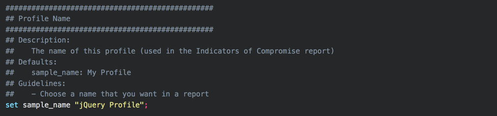

One of Cobalt Strike's most valuable features is its ability to modify the behavior of the Beacon payload. By changing various defaults within the framework, an operator can modify the memory footprint of Beacon, change how often it checks in, and even what Beacon's network traffic looks like. All of these features are controlled by the Malleable C2 profile, which is chosen when starting the team server.

<!-- truncate -->
The article makes the assumption that you understand the basics of malleable C2 and is intended to be used as reference for designing and creating malleable C2 profiles. The profile found at [(https://github.com/threatexpress/malleable-c2](https://github.com/threatexpress/malleable-c2) is to used as a reference profile. It is highly documented and contains tips and guidance to aide in creating new C2 profiles.

If you are new to malleable C2, we recommend starting with this reference by Jeff Dimmock (@bluscreenofjeff) https://bluescreenofjeff.com/2017-01-24-how-to-write-malleable-c2-profiles-for-cobalt-strike/ or reading the other references.

Big thanks to [@andrewchiles](https://twitter.com/AndrewChiles) and [@001SPARTaN](https://twitter.com/001SPARTaN) for helping test and develop this C2 profile!!!

- Don't use defaults. Use a profile.
- Modify sample profiles before use. It's likely that public Malleable C2 profiles are signatured by security products.
- Remember you're still generating "beaconing" network traffic that creates a detectable pattern that is mostly independent of the chosen profile
- Test, Test, Test

The following are quick tips to consider when setting parameter values. Follow this to reduce troubleshooting errors.

Enclose parameters in double quote, not single

```
set useragent "SOME AGENT";   # GOOD
set useragent 'SOME AGENT';   # BAD
```

Semicolons are ok

`prepend "This is an example;";`

Escape Double quotes

`append "here is "some" stuff";`

Escape Backslashes

`append "more \ stuff";`

Some special characters do not need escaping

`prepend "!@#$%^&*()";`

The example profile used in the post can be found at [https://github.com/threatexpress/malleable-c2](https://github.com/threatexpress/malleable-c2). This C2 profile is designed to mimic a jQuery request. This javascript framework is often used by many websites and may blend into a target's network.

Consider your target when deciding on what a profile to emulate. C2 traffic should blend in with normal traffic. Network traffic from a C2 profile may bypass network sensors, but you want to tune to convince a defender that traffic is legitimate. Convincing a network analyst or security team that traffic is safe is a good technique to bypass security defenses and cause analysts to ignore alerts or mark them safe. We chose to use a jQuery request to blend in. This is a generic approach and may work against wide range of targets.

Start from scratch or use a template? We recommend using an existing profile and develop your own template. The jQuery profile has been tuned and tweaked as a base profile we have used for a few years. It is often used as the starting point to build new profiles.

The reference profile is self-documented, but let's walk through each section…

:::note[Malleable C2 References]
The references and guidelines described below use the Malleable C2 profile found at [https://github.com/threatexpress/malleable-c2](https://github.com/threatexpress/malleable-c2).
:::

## Profile Name

Choose a profile name you would like to see in your reports. This does not affect Beacon's traffic or its footprint on target.

## Sleep Times

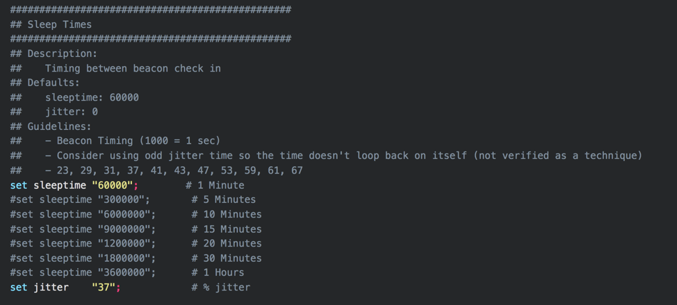These settings control the default time between Beacon check in (in milliseconds). A new HTTP/S beacon spawned using this C2 profile will check in using the sleep time as its callback interval, plus a random amount of time up to the specified by the jitter percentage. Choose a default time that will suit your operational needs, along with any OPSEC considerations. This example uses 60 seconds. This may be too aggressive for many engagements, and some defensive products may quickly detect beaconing behavior if it is too regular.

## User-Agent

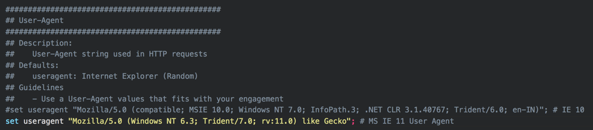Use a User-Agent value that fits with your engagement. If possible, try to capture a real User-Agent string from the target organization, to blend in with real traffic. For example, consider sending a benign e-mail with a web bug to target organization members and monitor the User-Agents sent in subsequent GET requests. If you are using plaintext HTTP traffic, or if SSL interception is in place in the target environment, a User-Agent string that doesn't match the environment can provide an indicator for defenders.

## SSL Certificate

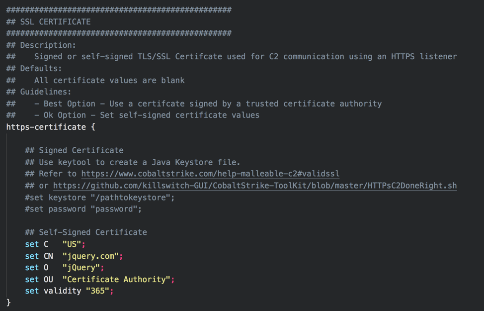This setting controls the SSL certificate used for HTTPS communications. If possible, utilize a real, properly-issued SSL certificate for the domain you're using. LetsEncrypt can issue free SSL certificates that are trusted by all major operating systems and browsers, and will make it harder for defenders to inspect Beacon traffic.

SSL certificate store creation steps are well documented in

:::tip[Protect your C2 Server]
It is generally recommended to setup your target facing HTTPS certificates on redirector hosts. This limits the reconfiguration required on your teamserver in case a domain is burned during an operation. Caveat: Some CDN providers require your origin host to maintain a valid SSL certificate and your teamserver will need a trusted SSL certificate installed for Domain Fronting to function. Refer to the Cobalt Strike documentation [https://www.cobaltstrike.com/help-malleable-c2#validssl](https://www.cobaltstrike.com/help-malleable-c2#validssl) or this post by [@bluscreenofjeff](http://twitter.com/bluscreenofjeff) [https://bluescreenofjeff.com/2017-01-24-how-to-write-malleable-c2-profiles-for-cobalt-strike/](https://bluescreenofjeff.com/2017-01-24-how-to-write-malleable-c2-profiles-for-cobalt-strike/) for instructions on configuring SSL with Cobalt Strike.
:::

## SpawnTo Process

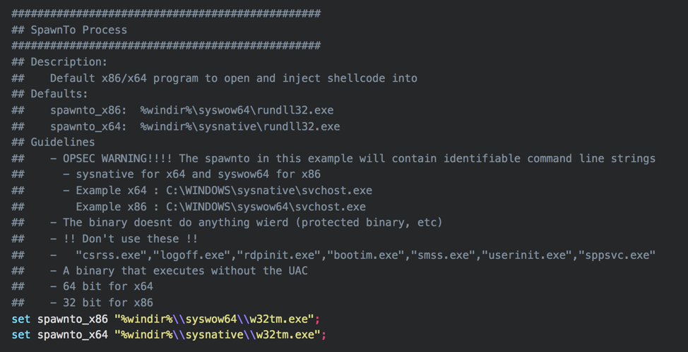The spawnto settings control what process a beacon will spawn for post-exploitation jobs, and when using the spawn command. This command can even use command line parameters

`set %windir%\sysnative\svchost.exe -k localservice -p -s fdPHost`

The additional parameters may help a Beacon blend in more if a defender looks at the command line of running processes. It can be difficult to find good candidate to use with spawnto. Experiment and test before selecting.

General Guidelines:

- Don't use protected binaries. How do you know if they are protected? Test
- Don't select binaries that executes with UAC
- Choose a 64 bit binary for x64 payloads and 32-bit payload for x86 payloads
- Consider choosing a binary that would not look strange making network connections

## SMB Beacons

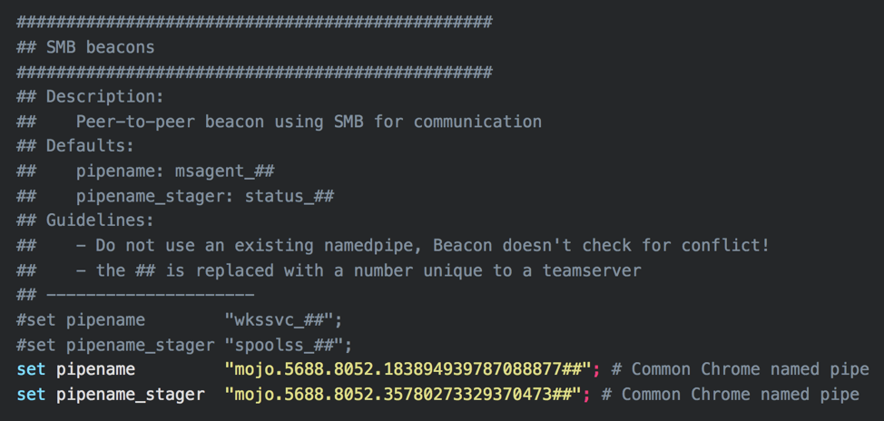SMB Beacons use named pipes to communicate through a parent Beacon. This allows for peer-to-peer communication between Beacons on the same host or across the network. The SMB Beacon's pipe names can be configured. Do not use default settings, as some defensive products will look for these defaults. Try to choose something that will blend in with the target environment. Follow this link: [https://www.cobaltstrike.com/help-smb-beacon](https://www.cobaltstrike.com/help-smb-beacon) for more information on SMB Beacons.

## DNS Beacons

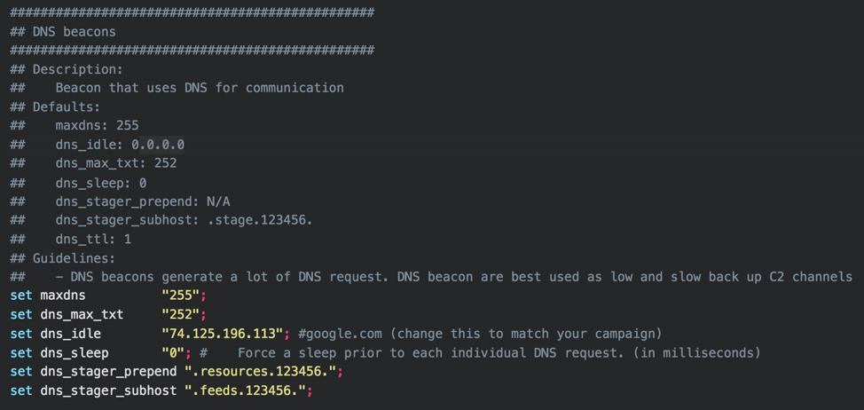DNS Beacons use DNS for all or part of their communications. Depending on the target environment's defensive technologies, DNS traffic can be easily detected, but is often a blind spot for defenders. DNS is best used as low and slow backup channel. Change the defaults to better fit your engagement. Follow this link [https://www.cobaltstrike.com/help-dns-beacon](https://www.cobaltstrike.com/help-dns-beacon) for more information on DNS Beacons.

## Staging Process

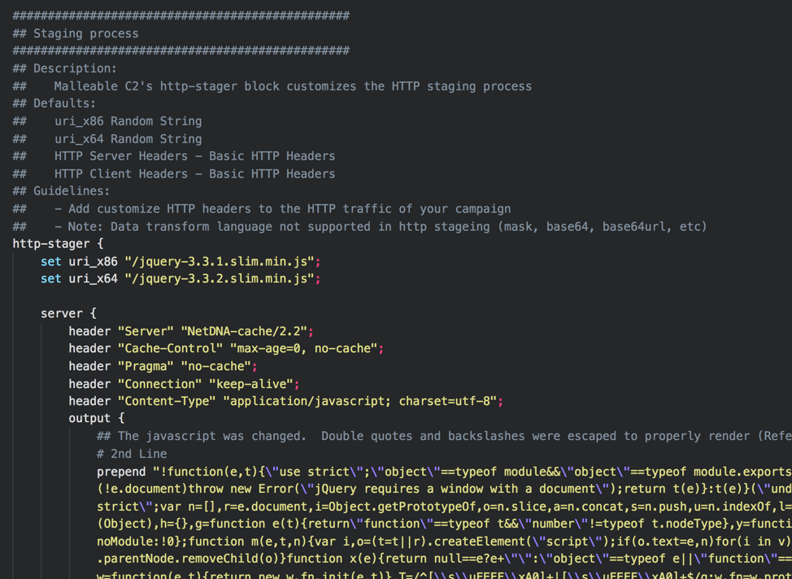… truncated…

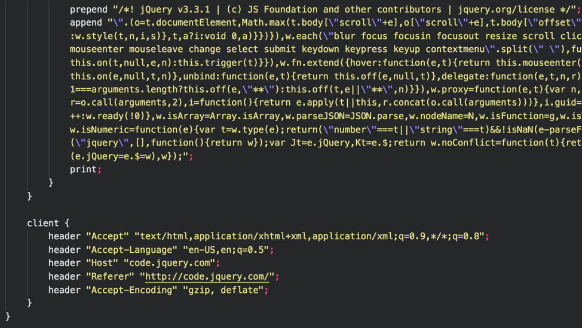 The Beacon staging process can be customized. The staging process is the stub of code used to fully load a Beacon. Read this post https://blog.cobaltstrike.com/2013/06/28/staged-payloads-what-pen-testers-should-know/ to learn more about the Beacon staging process. Fortunately, the HTTP characteristics of the Beacon stager can be modified. Change these settings to mimic a single legitimate HTTP request/response.

In this example the requests are sent to **/jquery-3.3.1.slim.min.js** or **/jquery-3.3.2.slim.min.js**, dependent on the target process architecture, to begin the staging process. The HTTP server parameters are built to mimic a jQuery request. The Beacon commands and payloads are blended in to a chunk of the jQuery javascript text. The client makes a request that is reasonable when requesting jQuery from content delivery network. Many websites do this with **http://www.google-analytics.com/ga.js"> src="jquery-3.3.1.min.js">**. The URIs can be modified to look like other CDNs. For example, you could modify the http-stager to look as if it is pulling from the Microsoft jQuery CDN. https://ajax.aspnetcdn.com/ajax/jQuery/jquery-3.3.1.min.js

In some cases, it may be better to use stageless payloads, as the staging process is an indicator that defensive products can alert on.

## Memory Indicators

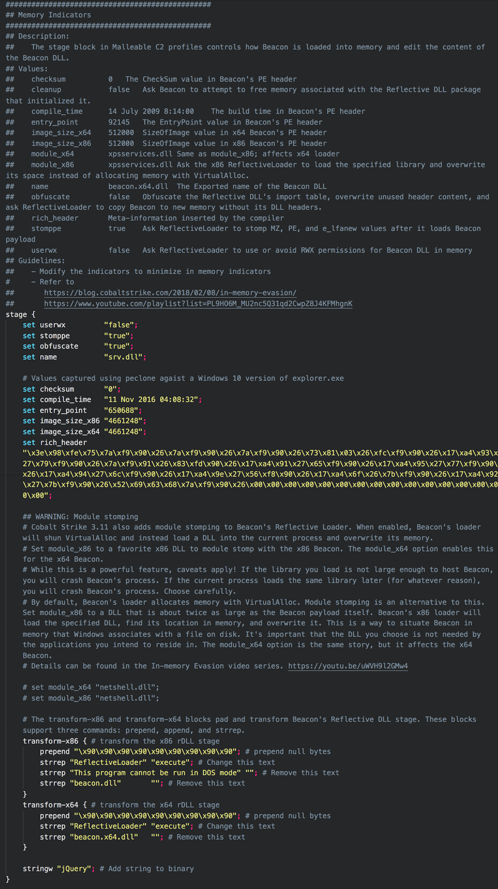 Some of the newest Malleable C2 features enable modification of many Beacon memory indicators. This topic can get quite deep and deserves it own blog post. Refer to https://blog.cobaltstrike.com/2018/02/08/in-memory-evasion/ and https://www.youtube.com/playlist?list=PL9HO6M_MU2nc5Q31qd2CwpZ8J4KFMhgnK for details on controlling Beacon memory indicators. This example uses the peclone tool to rip the memory metadata from explorer.exe, save as part of the Beacon payload, and uses several of the recommendations from Raphael's "In Memory Evasion" blogpost.

## HTTP GET

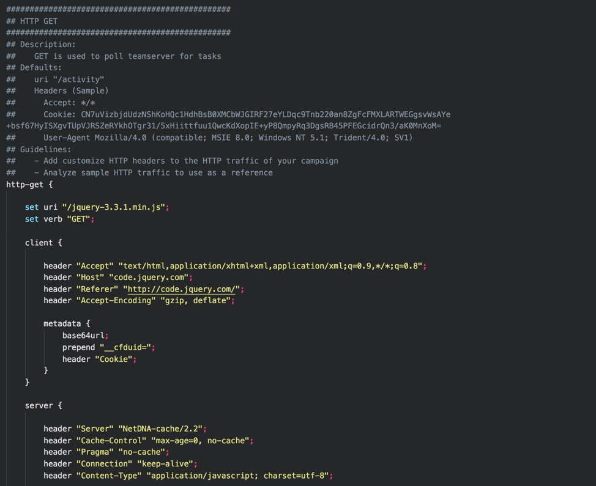… truncated…

Like the http-stager section, the HTTP GET requests/responses can be modified. This section is used to check a teamserver for tasks. More information can be found here [https://www.cobaltstrike.com/help-http-beacon](https://www.cobaltstrike.com/help-http-beacon). This profile uses a similar format found in the http-stager. The difference is the use of the cookie **\_\_cfduid=**. This value contains information about the Beacon and is used by the teamserver to issue tasks. The teamserver responds with a task hidden in the jQuery javascript text. Modify this section to match the HTTP traffic you would like to use. If you choose to use a GET-only profile (see below), this is also how Beacon transmits information back to the teamserver.

:::note
The **set uri** option can accept multiple URIs. This can be used to add diversity to your requests. However, Beacons will not perform requests in a round robin style as you might assume and instead a single URI from the list will be assigned to each Beacon during staging.
:::

## HTTP POST

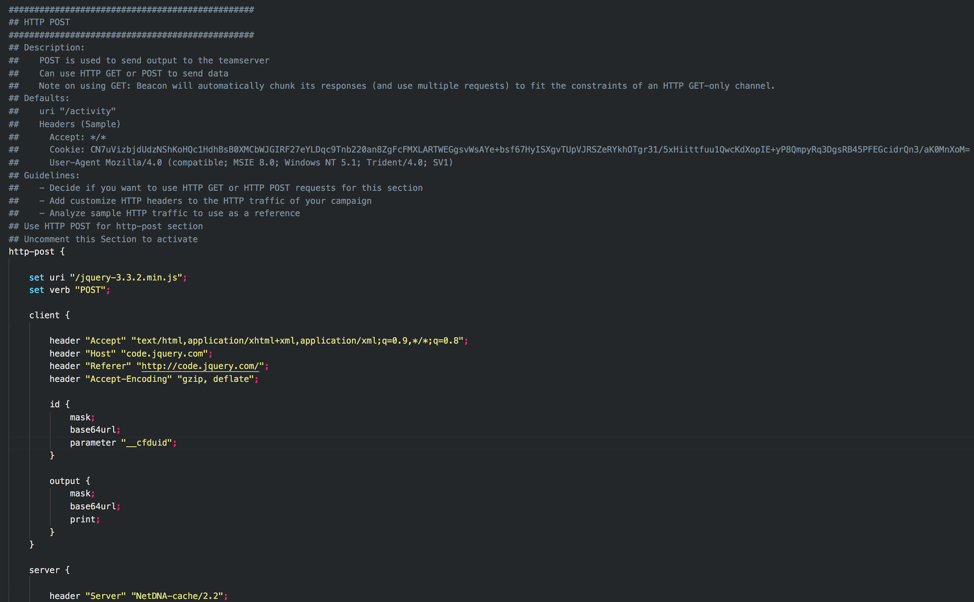 Like the http-stager and http-get sections, the HTTP-POST requests/responses can be modified. The HTTP-POST section serves as Beacon's response to commands issued by the server and can actually be performed as a HTTP GET or HTTP POST request. This example uses an HTTP POST as shown with **set verb "POST";** The HTTP traffic follows the same style of the HTTP-GET section and mimics a jQuery request. You can change the mode from HTTP-POST to HTTP-GET by commenting out the POST section and uncommenting the GET section of HTTP-POST.

:::note[GET-Only Profiles have Trade-offs]
GET-Only profiles have some trade-offs and may leave you scratching your head when attempting to pull large amounts of data (i.e. download a file or take a screenshot). This is due to the way data is transmitted within the URI, URI parameters, or Headers. This side-effect is well documented by Raphael at
:::

It is important to always validate and test Malleable C2 profiles before using them on a target. A malformed profile can easily cause Beacons to fail to check in, or to not send output from tasks. Always test new C2 profiles before utilizing them in a real-world situation.

## C2lint

C2lint is a tool provide with Cobalt Strike to test a profile for errors. Run this and correct errors before using on an engagement. [https://www.cobaltstrike.com/help-malleable-c2](https://www.cobaltstrike.com/help-malleable-c2)

:::tip
`./c2lint c2lint jquery-c2.3.11.profile`
:::

## Manual Testing

In addition to testing with c2lint, manually test all features of a Beacon on a test system.

_Quick Steps for Manual Testing and Validation_

- Start wireshark
- Start a teamserver using the test profile
- Create a HTTP listener (named http)
- Create a SMB listener (named smb)
- Create a Scripted Web Delivery attack to stage the HTTP Beacon
  - Attacks -> Web Drive-by -> Scripted Web Delivery
- Run the PowerShell on a test Windows system as an Administrator
- Interact with the elevated Beacon
- Spawn new Beacons, interact with each, and execute spawn commands:

```
spawn x64 http
spawn x86 http
spawn x64 smb
spawn x86 smb
```

- Review the packet capture data to ensure the http traffic is what you expect:
  - Review the staging process
  - Review the http-get process
  - Review th http-post process (even if you use GET)
- Execute other Beacon commands to ensure it is working as expected (at a minimum):

```
keylogger
screenshot
download
upload
```

## References

- Cobalt Strike Malleable C2 Help Documents – https://www.cobaltstrike.com/help-malleable-c2
- Example Profiles – https://github.com/rsmudge/Malleable-C2-Profiles
- Another profile reference (@bluscreenofjeff) – https://bluescreenofjeff.com/2017-01-24-how-to-write-malleable-c2-profiles-for-cobalt-strike/
- Random profile generator (@bluscreenofjeff) – https://bluescreenofjeff.com/2017-08-30-randomized-malleable-c2-profiles-made-easy/
- In-memory Evation (Raphael Mudge) – https://www.youtube.com/playlist?list=PL9HO6M_MU2nc5Q31qd2CwpZ8J4KFMhgnK
- Cobalt Strike 3.6 – A Path for Privilege Escalation (Raphael Mudge) – https://blog.cobaltstrike.com/2016/12/08/cobalt-strike-3-6-a-path-for-privilege-escalation/
- Malleable Command and Control (Raphael Mudge) – https://blog.cobaltstrike.com/2014/07/16/malleable-command-and-control/
