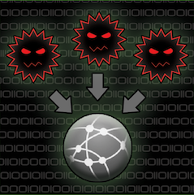

I was recently asked to perform an evaluation of multiple command and control (C2) agents. Rather than spending an exorbitant amount of time (that could be used building a custom C2) on an evaluation, I decided to perform a quick comparison of several popular C2 agents.

<!-- truncate -->
Systems for testing included Ubuntu 16.04, Ubuntu 18.04, MacOS 10.14.6, and Windows 10 (Defender, CrowdStrike, Tanium, McAfee, and a custom defense agent) all fully patched and updated as of August 19,2019.

This comparison is in no way a complete review, evaluation, or judgment on the validity of any agent. Rather it is a very quick assessment of my first take on each (think hours not months). I also acknowledge that if a function, feature, or build did not work after two consecutive attempts it was abandoned.

All readers should note that building a C2 agent or framework isn't easy. Building one that can handle the types of actions a true Red Team may perform while avoiding defensive mechanisms or processes and ensuring effective functionality is tough! Kudos to each of the authors!

---

## C2 Comparison Matrices

| Name          | License    | Purpose  | Platforms Supported | Project Language  | Docker | Collaborative | Link                                         |
| ------------- | ---------- | -------- | ------------------- | ----------------- | ------ | ------------- | -------------------------------------------- |
| Apfell        | BSD3       | Post-Exp | Cross               | python            | Yes    | Yes           | https://github.com/its-a-feature/Apfell      |
| Cobalt Strike | Commercial | Multi    | Win                 | Sleep             | Yes    | Yes           | https://www.cobaltstrike.com/                |
| Covenant      | GNU GPL3   | Post-Exp | Cross               | C# (.NET)         | Yes    | Yes           | https://github.com/cobbr/Covenant            |
| Empire        | BSD3       | Post-Exp | Cross               | Python            | Yes    | No            | https://github.com/EmpireProject/Empire      |
| Faction       | BSD3       | Post-Exp | Multi               | Python            | Yes    | Yes           | https://github.com/FactionC2/Faction         |
| iBombshell    | GNU GPL3   | Post-Exp | Win                 | Powershell        | Yes    | No            | https://github.com/ElevenPaths/ibombshell    |
| Koadic        | Apache 2   | Post-Exp | Win                 | VBScript/JScript  |        | No            | https://github.com/zerosum0x0/koadic         |
| Merlin        | GNU GPL3   | Post-Exp | Cross               | Go                | No     | No            | https://github.com/Ne0nd0g/merlin            |
| Pinjectra     | BSD3       | ProcInj  | Win                 | C+                | NA     | NA            | https://github.com/SafeBreach-Labs/pinjectra |
| PoshC2        | BSD3       | Post-Exp | Cross               | Powershell/Python | No     | Limited       | https://github.com/nettitude/PoshC2_Python   |
| Sliver        | GNU GPL3   | Post-Exp | Cross               | Go                | Yes    | No            | https://github.com/BishopFox/sliver          |
| Silentrinity  | GNU GPL3   | Post-Exp | Multi               | Python            | No     | Yes           | https://github.com/byt3bl33d3r/SILENTTRINITY |
| Trevor C2     | WTH        | Post-Exp | Multi               | Python/Powershell | Yes    | No            | https://github.com/trustedsec/trevorc2       |
|               |            |          |                     |                   |        |               |                                              |

Note: I’ve identified differences between multi and cross platform. Cross supports some combination of Windows, Linux, and/or Mac natively. Multi indicates the ability to (easily) write agents to support other platforms. (In this context Cross is better :))

| Name          | Cmd Exec | Script Exec | Pivot Cmds | Traffic Fwd | File Upload | File Download | Credential Gathering | Token Manipulation | Session Pivoting | Malleable C2 | Memory or Disk Resident | MITRE ATT&CK |
| ------------- | -------- | ----------- | ---------- | ----------- | ----------- | ------------- | -------------------- | ------------------ | ---------------- | ------------ | ----------------------- | ------------ |
| Apfell        | x        | x           | -          | -           | x           | x             | L                    | -                  | -                | x            | D                       | x            |
| Cobalt Strike | x        | x           | x          | L           | x           | x             | x                    | x                  | x                | x            | M or D                  | x            |
| Covenant      | x        | x           | x          | L           | x           | x             | x                    | x                  | -                | x            | M or D                  | -            |
| Empire        | x        | x           | -          | -           | x           | x             | x                    | x                  | -                | x            | M or D                  | x            |
| Faction       | x        | x           | x          | L           | x           | x             | -                    | -                  | -                | x            | D (M?)                  | x            |
| iBombshell    | x        | x           | x          | L           | x           | x             | x                    | x                  | -                | With effort  | M                       | -            |
| Koadic        | x        | x           | B          | L           | x           | x             | x                    | L                  | -                | -            | M or D                  | -            |
| Merlin        | x        | x           | x          | L           | x           | x             | x                    | L                  | x                | x            | D                       |              |
| Pinjectra     |          |             |            |             |             |               |                      |                    |                  |              |                         |              |
| PoshC2        | x        | x           | -          | L           | x           | x             | x                    | x                  | -                | x            | D                       | x            |
| Sliver        | x        | x           | -          | -           | x           | x             | -                    | L                  | -                | L            | D                       |              |
| Silenttrinity | L        | L           | L          | L           | x           | L             | x                    | -                  | exit             | L            | D                       |              |
| Trevor C2     | x        | x           | -          | -           | -           | -             | -                    | -                  | x                | L            | D                       |              |
|               |          |             |            |             |             |               |                      |                    |                  |              |                         |              |

Description:

- Cmd Exec - Execution of host cmds with switches via console
- Script Exec - Execution of various scripts from console
- Pivot Cmds - Ability to natively relay cmds to lateral systems via console
- Traffic Fwd - Ability to natively relay traffic to lateral systems via console
- File Upload/Download - Ability to place and pull files via console
- Cred Gathering - Ability to pull credentials (plaintext|hash|tokens) from host via console
- Token Manipulation - Ability to create and/or send tokens to host or lateral system via console
- Session Pivoting - Ability to fwd specific session types (web, application, etc.) to lateral systems via console

Legend:

- X- Yes
- L - Limited
- B - By using a binary
- \- \- No (or not native)

---

### **Apfell**

**Code**: Python https://github.com/its-a-feature/Apfell
**License:** BSD-3

**Pros:**

- Python
- Extensible code base
- Crossplatform
- Docker
- Web UI
- JavaScript for Automation (Mac OS)
- Chrome Extension Payload
- Very Cobalt Strike(ish)
- Reporting (Artifacts, ATT&CK Mapping, PDF of Tasks)

**Cons:**

- Python 2.7 or multiple errors
- RabbitMQ
- Lots of “ToDos“ and feature changes planned

### **Cobalt Strike**

**Code**: _Sleep_ https://www.cobaltstrike.com/
**License:** Commercial

**Pros:**

- Collaborative
- Well tested
- Highly capable
- Recon, Phishing, Post-Exp, Browser Pivoting, C2, Reporting
- Kits for extensibility
- https://www.cobaltstrike.com/help-externalc2
- https://github.com/xorrior/raven

**Cons:**

- Windows Specific
- PO problems
- Mods require custom kits or sleep builds

### **Covenant**

**Code:** C# https://github.com/cobbr/Covenant
**License: GNU GPL3**

**Pros:**

- Extensible code base (with exp)
- Multi-User
- Crossplatform
- Docker
- Web UI
- Chrome Extension Payload
- Many Cobalt Strike similarities

**Cons:**

- Written in C#
- Only HTTP(s) listeners
- Constructing complex Tasks can be annoying (if not time consuming)

### Empire

**Code:** Python https://github.com/EmpireProject/Empire
**License:** BSD3

**Pros:**

- Multi-platform
- Written in python
- Versatile

**Cons:**

- Poor documentation (good at the time but outdated)
- Poor logging
- End of Life
- Often buggy

### **Faction**

**Code:** https://github.com/FactionC2/Faction
**License: BSD3**

**Pros:**

- Micro Service Architecture
- Extensible
- Communicates via message queues (JSON based)
- Fully functional API (API required)
- Crossplatform
- Rest and Socket.IO
- RBAC
- SQL Query Capable
- WebUI

**Cons:**

- Relies on RabbitMQ
- Buggy
- Limited review
- Unproven
- Disk (states single line exec, but none worked in testing)
- No native AV evasion
- States it’s a PoC so may be further dev’d or dropped

### **iBombshell**

**Code:** https://github.com/ElevenPaths/ibombshell
**License: GNU GPL3**

**Pros:**

- Memory Resident
- Modules can be written easily (PS)
- Build based on Metasploit

**Cons:**

- Buggy, buggy, buggy!
- PowerShell (Req PS 3.0^)
- Windows (Partially supports linux with PS and python)
- Limited review
- Base Framework flags AV

### **Koadic**

**Code:** https://github.com/zerosum0x0/koadic
**License: Apache 2**

**Pros:**

- PowerShell
- Based on Metasploit (need MSF for full use)
- Easily track domain users vs admins

**Cons:**

- Windows Only
- PowerShell
- Limited maintenance
- Limited review
- Requires cleartext creds for sessions or tokens (no keys/PTH/Kerb/etc)
- Base flags AV

### **Merlin**

**Code:** https://github.com/Ne0nd0g/merlin
**License: GNU GPL3**

**Pros:**

- Cross Platform
- Extensible
- HTTP/2
- Metasploit Similarities
- Leverages multiple known proven modules

**Cons:**

- Buggy
- Limited review
- Requires binaries/file loads to disk
- Limited capability for mem resident (recompile is buggy)
- No native AV obfuscation
- Significant dll mods to avoid AV

### **Pinjectra**

**Code:** https://github.com/SafeBreach-Labs/pinjectra
**License: BSD3**

**Pros:**

- TBD

**Cons:**

- Not C2
- TBD

### **PoshC2**

**Code:** https://github.com/nettitude/PoshC2_Python
**License: BSD3**

**Pros:**

- PowerShell
- Python
- Cross Platform
- Metasploit Styled
- Config controls all settings

**Cons:**

- Disk based
- No native AV obfuscation
- Payloads generated at server instantiation
- Single user console (additional consoles requires hole in fw for access unless on common port i.e. those you want for OPS)
- Separate server and console screens

### **Sliver**

**Code:** https://github.com/BishopFox/sliver
**License: GNU GPL3**

**Pros:**

- Crossplatform
- Anit-forensics (? Untested)
- Attempts to enforce good OPSEC
- Agents will reconnect if proc crash (within given timeframe)
- Agent info provided during profile generation
- Stable so far (no unvalidated crashes)
- Did not produce any alerts
- Native builds did not flag AV (Defender, CrowdStrike, Tanium. McAfee)

**Cons:**

- In Alpha
- Limited review
- Limited capabilities
- Generating with symbols takes a while (requires additional memory on server)
- Proc crashes if memory overrun (need several GB for generation)
- Generating without symbols is fast but is less obfuscated
- Cannot change callback timing
- Nearly interactive
- No logging
- Last check-in was not accurate in testing

### **Silenttrinity**

**Code:** https://github.com/byt3bl33d3r/SILENTTRINITY
**License: GNU GPL3**

**Pros:**

- Crossplatform
- Collaborative
- All actions logged
- Recently rewritten

**Cons:**

- Recently rewritten
- HTTP/1.1
- Limited review

### **TrevorC2**

**Code:** https://github.com/trustedsec/trevorc2
**License: WTH**

**Pros:**

- Does not use POST for exfil
- Mirrors chosen site for use
- Simple Interface
- Traffic looks like legit web (b64 to initial viewing)
- Can be used across platforms
- Alternates callback intervals
- Notes indicate future dev

**Cons:**

- Extremely limited
- Console has limited native functionality
- Looks like a project idea that hasn't taken off quite yet

## **Results**

Of the 12 C2 listed, none are viable for my needs in long-term operations. Several have benefits for short-term OPS; however, drawbacks must be weighed against operational objectives.

Cobalt Strike is extremely useful and viable for Windows based operations or if used in conjunction with a second C2.

If 2 were **required** outside Cobalt Strike, Sliver would be my first and Faction second choices with very specific use cases for each.
