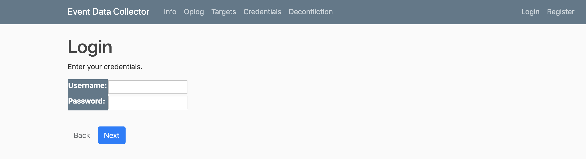

Event Data Collector (EDC) is a very basic django application used to capture data on the fly.

<!-- truncate -->
It is primarily designed to facilitate the flow of a cohesive red team by enabling both manual and automated collection of operational activities and information. It's not fancy, was designed in stages to meet the need of the hour, and has had some elements removed to protect multiple organizations.

It is expected only RT members assigned to the operation and those designated as Trusted Agents (TA), White Cell, or Control Cell members with a need-to-know will use EDC.

You can find the latest info, code, and setup instructions on [Github](https://github.com/threatexpress/edc).

---

## General Information

#### Views

Views are based off templates rather than builds. This enables the team to choose what is displayed in the view and what requires viewing the entry detail.

- Info (info): Information about the event
- OPLOG (oplogs) Operator Logs - Log entries of all actions
- Targets (targets): Actioned Targets - Any target asset where actions are performed (succeed or fail)
- Credentials (creds): Obtained Target Credentials - files, mimikatz, keylogging, etc.
- Payloads (payloads): Location for storing pre-made payloads (escalation, c2, peristance, etc.)
- Deconfliction (decon): Deconfliction Data - Basic data! Defensive elements (Blue Teams, SOC, etc.) side should provide more data for verified deconfliction. Note decon is just a subset of oplog data.

**Examples:**

_Full oplog view_
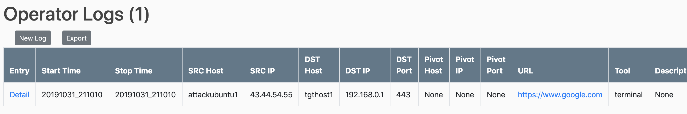

_oplog command and output_
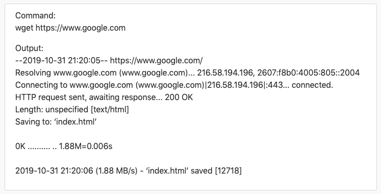

_Targets View_
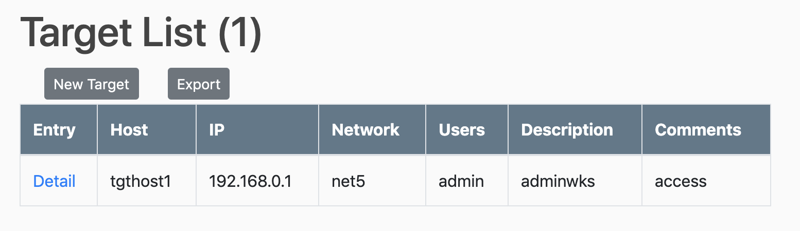

_Credentials View_
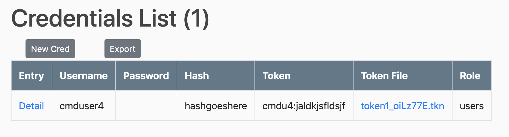

_Payloads_
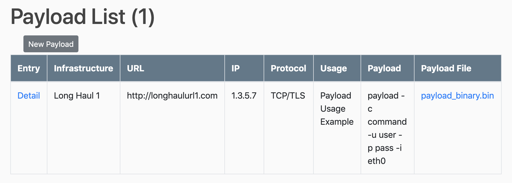

_Deconfliction_
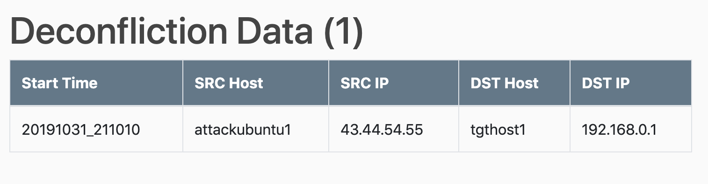

#### URLs

- info/
- oplogs/
- targets/
- creds/
- payloads/
- decon/
- tag/ - quick identification of tagged logs (tag/c2, tag/observation, tag/persistence)
- user/ - list of logs per operator (user/testerld)
- rta/ - Admin Dashboard (change this as desired)

#### Rest Framework

(Requires IsStaff for access)

- eventinfo/
- oplog/
- cred/
- target/
- api-token/ < Generate Key

---

### Authentication and Authorization

EDC requires an account to be assigned a role for any access. Although individual permissions can be applied, it is highly recommended to use the role based permissions.

#### Roles (Groups)

- Lead: Event lead or manager - Has privileges to all edc actions
- Operator: Operator or keyboarder - Has privileges to most edc actions less some permanent delete
- WhiteCell: Has only view privileges for Info and Deconfliction - Trusted Agent, Observer, Data Scientist, etc.

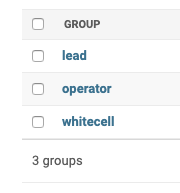

#### Role Permissions

| Permission       | Lead | Operator | WhiteCell |
| ---------------- | ---- | -------- | --------- |
| add cred         | x    | x        | -         |
| view cred        | x    | x        | -         |
| change cred      | x    | x        | -         |
| delete cred      | x    | x        | -         |
| add eventinfo    | x    | x        | -         |
| view eventinfo   | x    | x        | x         |
| change eventinfo | x    | x        | -         |
| delete eventinfo | x    | -        | -         |
| add oplog        | x    | x        | -         |
| view oplog       | x    | x        | -         |
| change oplog     | x    | x        | -         |
| delete oplog     | x    | x        | -         |
| add payload      | x    | x        | -         |
| view payload     | x    | x        | -         |
| change payload   | x    | x        | -         |
| delete payload   | x    | x        | -         |
| add target       | x    | x        | -         |
| view target      | x    | x        | -         |
| change target    | x    | x        | -         |
| delete target    | x    | x        | -         |
| add decon        | x    | x        | -         |
| view decon       | x    | x        | x         |
| change decon     | x    | x        | -         |
| delete decon     | x    | x        | -         |

#### Accounts

It is recommended to create new accounts and remove the examples once functionality of new are confirmed.

| Username | Password    | Role                   |
| -------- | ----------- | ---------------------- |
| edcadmin | admin pass1 | Superuser (Admin Dash) |
| testerld | user passld | Lead Role              |
| testerop | user passwc | Operator               |
| tester1  | user pass1  | Operator               |
| tester2  | user pass2  | Operator               |
| testerwc | user passwc | WhiteCell              |

##### Account Permissions

| User     | Role      | Info | Oplog | Targets | Creds | Payload | Deconfliction |
| -------- | --------- | ---- | ----- | ------- | ----- | ------- | ------------- |
| edcadmin | Super     | RWD  | RWD   | RWD     | RWD   | RWD     | RWD           |
| testerld | lead      | RWD  | RWD   | RWD     | RWD   | RWD     | RWD           |
| testerop | operator  | RW   | RWD   | RWD     | RWD   | RWD     | RW            |
| tester1  | operator  | RW   | RWD   | RWD     | RWD   | RWD     | RW            |
| tester2  | operator  | RW   | RWD   | RWD     | RWD   | RWD     | RW            |
| testerwc | whitecell | R    | -     | -       | -     | -       | R             |

#### 2FA

All accounts have the option for 2FA (Authenticator App).
Each account will need to enable 2FA via profile.

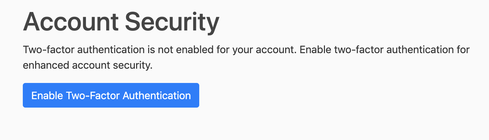

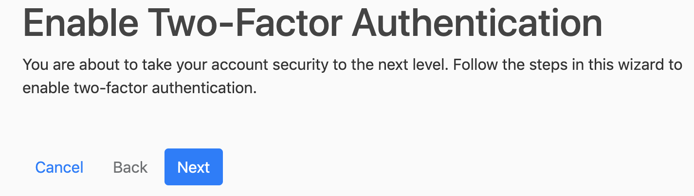

---

### Consolidated Security Information

- Permission Based Roles (Groups)
  - Login Required (Decorators or Mixins)
  - Permission Required (Decorator or Mixins)
- Role Based Accounts
  - Lead
  - Operator
  - White Cell
- Individual Accounts (no group or shared accounts)
- Multi-Factor Authentication
  - 2FA Token
- Protections
  - SSL/TLS (Communication Transport)
  - Click Jacking Protection
  - Cross Site Request Forgery Protection
  - Cross Site Scripting Protection
  - Host Header Validation
  - Sessions Security
  - SQL Injection Protection
  - User uploaded content
    - Profile limited to images
      - All users can change respective profiles
    - All other forms allow any file type
      - Allows collection of various file types and interesting information
      - Enables bypass of some XSS and CSRF protections (stored - file)
      - Limited to only Leads and Operators (should be Trusted Users)
  - Drive or volume encryption recommended (DAR)

---

### Quick Tips

- Tags can be any desired keyword useful to your team. These can be used to create a quick view for your desired case (i.e. identify all tagged findings)

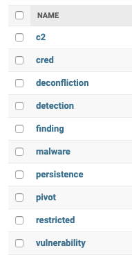

- User tokens must be passed for access to the rest framework.
- All views have an associated template (vs. a tables build). Adding or removing fields from view is a simple as adding/removing from the template.
- Some secrets are hidden from view (i.e. the plaintext password is hidden on the creds table but visible in details)
- Setup instructions on github provides AWS S3 and Email Password Reset options
- Anyone can register (assuming it is actually open and avail on www)
  - There are no permissions assigned by default. Login produces no views and no access
  - The deployment should have restricted access (ACL), or be accessible only from VPN, etc.
  - You may optionally restrict registrations to a specific email domain
- The bashrc is recommended for use as it saves terminal logs locally. It also has several simple example functions for submitting data to EDC. These bash examples should be binaries or python execs (client) in your path. The included functions accepts (or if omitted prompts for) entry data, appropriately names and captures a screenshot (if oplog), and submits the entry.

---

## Use

- Manual entry
  - Use the provided forms
- bash_functions (see github repo)

```
    log -h
    cred -h
    target -h
```

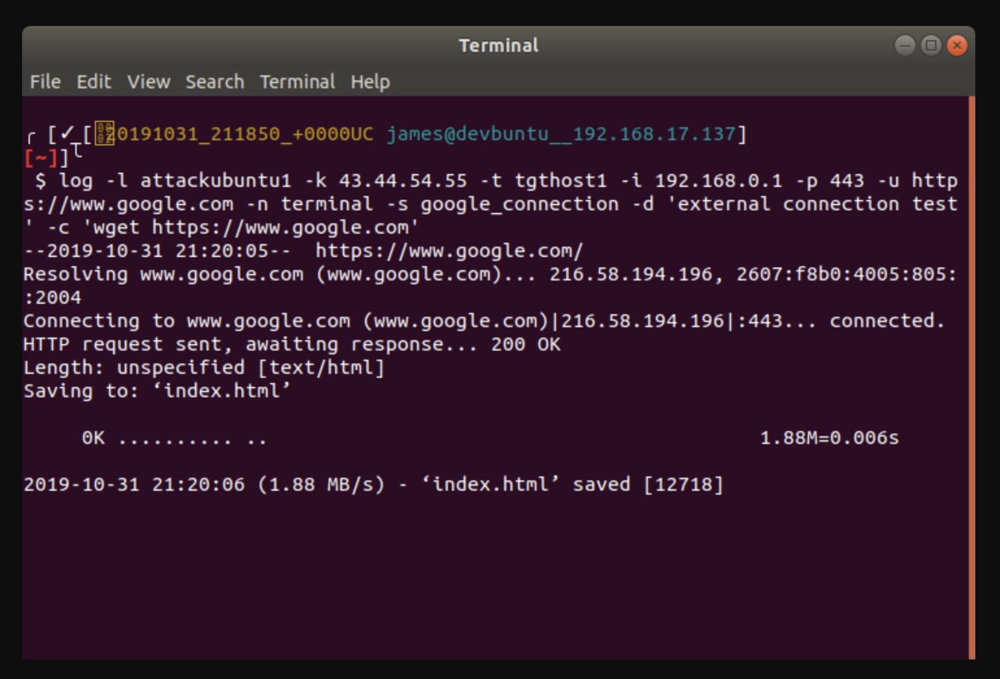

- API (curl examples)

```
# Obtain token
curl -d 'username=testerld&password=user passld' https://domain.com/api-token/

# Pull all oplogs (or /cred/ or /target/)
curl https://domain.com/oplog/ -H 'Authorization: Token 333...de8'

# Post a new log entry
curl -d 'src_host=attackimage2&src_ip=44.33.22.11&dst_host=corpwks01&dst_ip=143.144.145.146&dst_port=445&tool=terminal&description=smb_relay&result=success&operator_id=9' https://domain.com/oplog/ -H 'Authorization: Token 333...de8'

```
