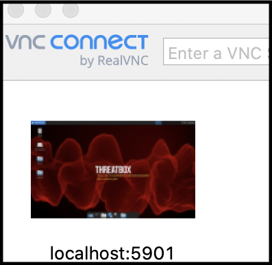
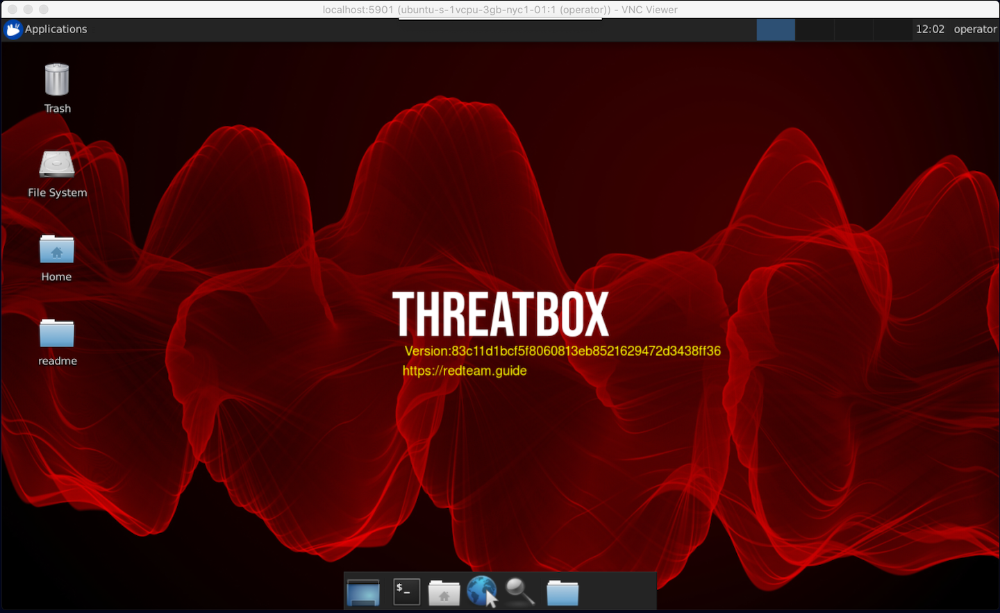
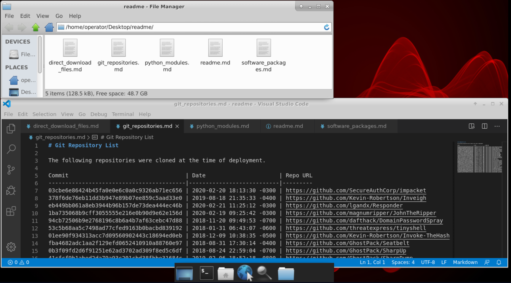
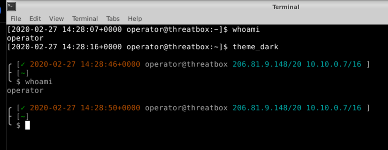
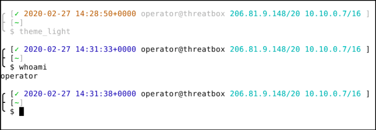
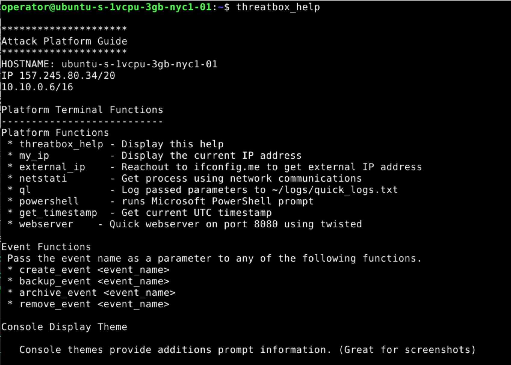
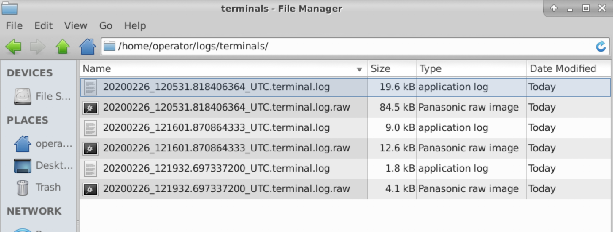
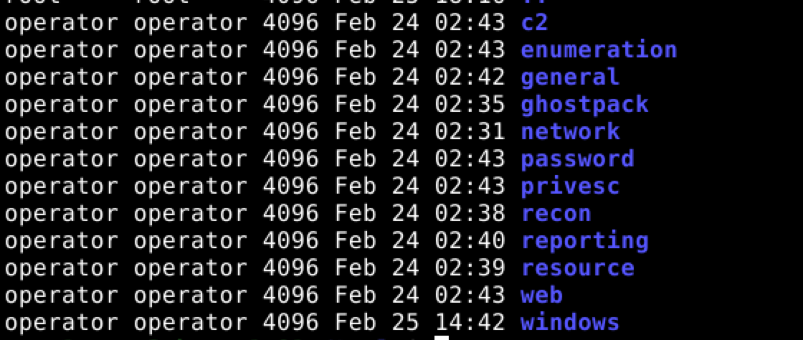
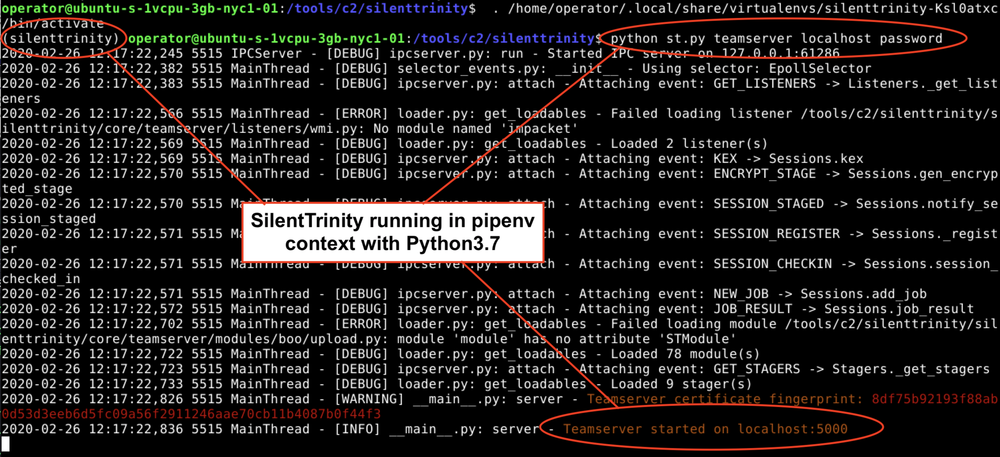
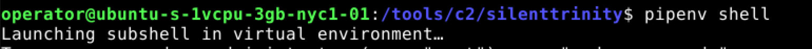

[threatbox](http://github.com/threatexpress/threatbox)

Security testers need a mixed set of tools. Some in the penetration testing and red teaming community argue that you shouldn't be limited to a specific set of tools. A threat can use anything they desire, right? This is true, but we are not the threat. We are part of the professional security testing community. Security testers shouldn't be limited to a specific set of tools, but downloading and using something randomly found on the internet is risky. A balance is needed. This balance is one way to separate security professionals from those who 'hack stuff.' We need a standard process to control the tools we use that are flexible enough to provide the capability we need with some assurances around the codebase. This can be achieved through a standard attack platform.

<!-- truncate -->

A standard attack platform is the common set of tools and hardware used by security testers, like a Red Team, to perform an engagement. The term **standard** is critical.

## A standard platform allows for

### Better logging

A common platform shares the same base build, directory structure, and built-in data capture capability. At a minimum, tracks and logs terminal commands. Better logging equals better engagement.

### Easier deconfliction

A common set of tools and payloads, along with a standard logging process, can help an organization quickly work through the deconfliction process. (https://redteam.guide/docs/definition-lexicon/#deconfliction)

### Common baseline

A universal base provides a stable, functional environment for a Red Team to operate. Consistency means more efficient operators.

### Access to a better toolset

A standard platform is designed using the knowledge of many people. Multiple senior team members can contribute their best tools, references, and guides. This raises the overall capability of a team by including expertise in the toolbox. Junior operators can utilize more sophisticated tools or techniques that often only exist in someone's head.

### Custom tools work across attack platforms

Red Teams and security testers often build custom tools. If these tools are developed to a common base, like a standard attack platform, they will work for all operators. Tools should just work, no more fighting installation of dependencies or “it works on my box”.

### Tool vetting

In some cases, Blue Teams or customers require red team tools to be vetted as threat faithful or provide assurance tools have no unknown malicious risk. When using a standard attack platform, a tool vetting process can be used before including a tool to the toolbox. This ensures all tools are managed and validated before use. Tool validation often occurs due to fear that the Red Team tools may cause unexpected damage to a system Demonstrating active control of a toolset is a way to professionalism and reduce fears that may arise during security tests.

### Consistent processes

Using a common baseline enables a standard set of procedures that allow the skills and knowledge of senior operators to be used by junior operators. This can significantly enhance an engagement's success and better use of limited resources.

Using a standard platform does not mean limiting the toolset. If a tool or capability is required, make it part of the platform, and document its inclusion. If an operator needs a new tool or unique ability for an engagement, use it. The standard attack platform is a common base meant to provide a stable and functional environment for Red Team operators or security testers to operate. It is not designed to limit the Red Team.

> TLDR: Be a security professional. Control the tools you use.

[Red Team Guide](http://redteam.guide) Details on the concept of a Standard Attack Platform and other Red Teaming topics can be found in the book Red Team Development and Operations - A practical guide, written by Joe Vest and James Tubberville.

---

## ThreatBox

[threatbox](http://github.com/threatexpress/threatbox)

ThreatBox is a standard and controlled Linux based attack platform. I've used a version of this for years. It started as a collection of scripts, lived as a rolling virtual machine, existed as code to build a Linux ISO, and has now been converted to a set of ansible playbooks. Why Ansible? Why not? This seemed to be the next natural evolution to the configuration of standard attack platforms.

Threatbox installed using the default setup is not a complete managed solution but is a great starting point to build and create a controlled attack platform.

:::note[Provisioning in the Cloud]
This project uses Ansible playbooks and roles to perform post-deployment configuration on a Linux target. It was tested on Ubuntu 18.04 provisioned in Digitalocean. Provisioning security testing boxes to cloud services providers is a personal preference determined by your own risk factors. Cloud provisioning is not required but does demonstrate the the system deployment side of DevOps. This project will not provision your target systems. This set of playbooks can be run against a Linux box you control (local or remote).
:::

It is designed to be used as a starter process in creating, managing, and using a standard attack platform for red teaming or penetration testing.

A few features:

- Standard tools defined as ansible roles
- GUI access via VNC over SSH
- Customizations designed to make security testing easier
- Variable driven to easily add or remove git repositories, OS packages, or python modules. (threatbox.yml)
- Version tracking of the deployed instance version and deployed tool versions. Version tracking helps meet compliance requirements and can help minimize fear by actively tracking all tools.
- Deployed software tracked in ~/Desktop/readme
- SSH port auto-switching. Deployment begins on SSH port 22, but reconfigures the target system to the desired SSH port using the `ansible_port` variable in `threatbox.yml`
- Download and locally compile several .net toolkits (i.e., SeatBelt.exe from Ghostpack https://github.com/GhostPack/Seatbelt)
- Python projects installed using pipenv to reduce dependency conflict. Use `pipenv shell` in the project directory to access. See https://realpython.com/pipenv-guide/ for pipenv usage guidance

Here are a few tools installed and ready for use:

- C2
  - crackmapexec
  - Metasploit
  - Covenant
  - Merlin
  - Silenttrinity
- Web
  - BurpSuite
  - Eyewitness
  - sqlmap
  - tinyshell
- GhostPack
  - Safetykatz
  - Seatbelt
  - Sharpdpapi
  - Sharpdump
  - Sharpup
  - Sharpwmi

### Screenshots

Connect to the GUI via VNC over SSH

```bash
threatboxip=10.10.10.10
ssh -p52222 -i ~/.ssh/threatbox_id_rsa -L 5901:localhost:5901 root@$threatboxip
```

VNC over SSH 

ThreatBox 

Tracking of installed tools 

Custom terminal options provide more context 

Light version of the terminal 

Attack platform custom commands 

Automatic logging of terminals 

Tool categories 

Pipenv used to control python projects





---

## Red Team Development and Operations


[Paperback - "Red Team Development and Operations", Zero-Day Edition](https://www.amazon.com/dp/B083XVG633/ref=sr_1_2?keywords=red+team+development)

[eBook - "Red Team Development and Operations", Zero-Day Edition](https://www.amazon.com/dp/B0842BMMCC/ref=sr_1_1?keywords=Red+Team+Development+and+Operations)

Companion site. https://redteam.guide/

Find the book on Barnes & Noble. https://www.barnesandnoble.com/w/red-team-development-and-operations-james-tubberville/1136264411?ean=9798601431828

Joe Vest ([@joevest](https://www.twitter.com/joevest)) and James Tubberville ([@minis_io](https://www.twitter.com/minis_io))
