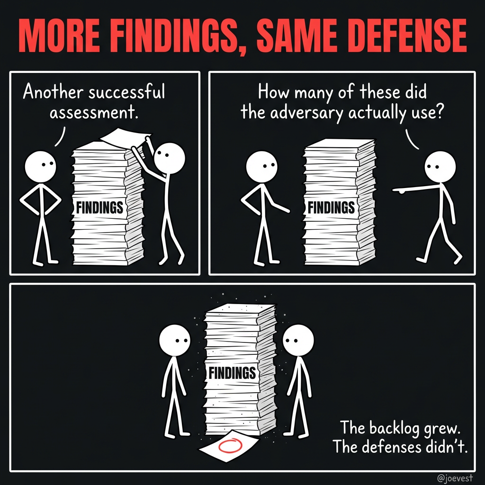

A red team spends three weeks crafting a novel lateral movement chain. The report is impressive — multi-stage, creative, technically sophisticated. But no real adversary operates that way, and existing detections already cover the behavior. The defensive improvements from the engagement? Zero.

This is the failure mode most red teams don't talk about: optimizing for clever access instead of adversary disruption.

<!-- truncate -->

The term "red teaming" has become overloaded — used to describe everything from basic penetration testing to advanced adversary simulation. That ambiguity creates misaligned expectations, and too many engagements end up focused on proving access rather than improving defenses.

I often use the phrase, _["The threat gets a vote."](/blog/threat-gets-a-vote/)_ If you're building a defense plan without considering how real adversaries think and operate, you're handing critical security decisions to the adversary. The traditional "find the bad, fix the bad" model assumes that identifying and remediating vulnerabilities results in steady improvement. It's a security fundamental, but it's incomplete. It overlooks how threats adapt and exploit operational blind spots.

**"We're not here to collect findings. We're here to disrupt the threat's ability to succeed."**

## The difference at a glance

Before going deeper, here's what the shift looks like in practice. A traditional red team report tells you what was compromised. Threat perspective feedback tells you why defense failed:

| Traditional Finding                          | Threat Perspective Feedback                                                                                                             |
| -------------------------------------------- | --------------------------------------------------------------------------------------------------------------------------------------- |
| We achieved domain admin.                    | No alerts triggered across five privilege escalation attempts. Detection logic is missing or improperly scoped.                         |
| We accessed sensitive data.                  | Data access occurred via service account impersonation. No user behavior analytics flagged the deviation.                               |
| We moved laterally via RDP.                  | Lateral movement was not correlated across asset groups. Logs were collected but not monitored.                                         |
| We exfiltrated data to an external endpoint. | Outbound transfer of bulk data from a staging server triggered no DLP alerts. Egress controls assumed internal-only traffic patterns.   |
| We persisted via scheduled task.             | Persistence mechanism went undetected for 72 hours. Scheduled task auditing was enabled but not reviewed by any workflow or automation. |

That table is the thesis of this post in miniature. One column documents what happened. The other tells you what to fix and why. The rest of this post is about how to get there.

## Start with a hypothesis, not an attack plan

Traditional red team objectives — "simulate an attack," "gain domain admin" — are too broad and often disconnected from the operational risk of the target. They demonstrate access but don't measure defensive readiness against a real-world adversary operating in that specific context.

The threat perspective starts with **threat-informed hypotheses**: precise, testable questions rooted in actual risk.

- _"Can we detect and respond to lateral movement techniques used by [APT X] against our Tier 1 service in Region A?"_
- _"If [Ransomware Group Y] gained initial access through our exposed web app, would our controls prevent encryption of high-value file shares within 2 hours?"_
- _"If a threat steals an access token from a developer's compromised endpoint, can they enumerate and access sensitive data in Z service? Will our detections identify unusual usage patterns, privilege escalation, or persistence mechanisms like backdooring the code pipeline?"_

Each hypothesis narrows the engagement to a high-value problem area and connects red team actions directly to organizational outcomes.

To craft strong hypotheses:

- **Identify critical business services and dependencies.** What matters to the mission?
- **Understand the adversaries likely to target those systems.** What are their goals and capabilities?
- **Assess environmental assumptions.** What do you believe is protected, segmented, or well-monitored — and what evidence backs that belief?
- **Examine technology-specific risks.** How might certain EDR configurations, cloud architectures, or access controls change the adversary's path?

Framing an engagement as a hypothesis also changes stakeholder conversations. Everyone understands what's being tested, why it matters, and what success looks like — not in terms of compromise, but in terms of threat resilience.

## Test what adversaries actually do, not what's theoretically possible

Threat research goes beyond studying adversary groups. It's about understanding how those threats intersect with the unique realities of your environment.

Start by identifying relevant threat actors and their known techniques — but don't stop there. The real value comes from mapping those behaviors onto your actual systems and services:

- How do your identity systems issue and validate trust?
- Where do architectural assumptions break down in cloud, hybrid, or segmented environments?
- How could internal workflows, automations, or integrations be manipulated in ways standard security controls don't anticipate?

Generic security practices assume ideal conditions — perfect segmentation, complete coverage, consistent logging, uniform policy enforcement. Real systems are messy. They contain misconfigurations, edge cases, legacy dependencies, and trust relationships that aren't obvious until they're exploited.

Effective threat research asks:

- How would a real adversary interact with our systems _as they actually function_, not as we designed them to?
- What behaviors or side effects might expose weaknesses or create unexpected access paths?
- Where do common security controls lose context, visibility, or enforceability?

### Map attack paths to real infrastructure

One powerful technique is attack path mapping — identifying, visualizing, and analyzing the steps a threat could take to move through your environment. These maps surface not just individual vulnerabilities, but how trust relationships, misconfigurations, and exposures combine to create exploitable chains.

Effective attack path mapping answers:

- What are the shortest or stealthiest paths to critical assets?
- Where can access escalate via shared infrastructure or inherited permissions?
- Which nodes, if hardened, would break multiple adversary chains?

Tools like BloodHound (for Active Directory), graph-based analyzers, or access path visualizers can surface these paths and tie threat behavior to actual exposure. This transforms planning from "Where do we go?" to "Which real-world path would the adversary choose, and can we prevent or detect along the way?"

Mapping also supports defender alignment: detection engineers and blue teams can place controls at key chokepoints, reducing attacker freedom of movement while improving detection fidelity. Threat research becomes a shared artifact that drives both offensive planning and defensive design.

## A finding tells you what broke. Feedback tells you why defense failed.

Traditional red team reports focus on findings — a list of exploited paths, vulnerabilities, and post-exploitation techniques. They demonstrate technical proficiency, but they don't always drive meaningful change.

The threat perspective shifts the goal from _what was exploited_ to _what was observed, missed, or delayed_ across the defensive lifecycle:

- What detection gaps were exposed?
- What visibility was missing at key points in the attack chain?
- How quickly and accurately did defenders recognize, triage, and respond?
- What assumptions about controls, segmentation, or alerting proved invalid in practice?

This turns red team output into operational feedback. Teams don't just learn that an attack could succeed. They understand _why_ it wasn't stopped, where early warning signals failed, and what specific actions close those gaps.

That's how you disrupt the threat's success — not just document it.

## If detection engineering never sees your results, you wasted the engagement

The threat perspective only drives improvement when there's a mechanism to act on what's observed. That mechanism is telemetry, and the engine that powers it is the relationship between red teams and detection engineering.

Closing the loop means more than confirming whether logs exist or alerts fired. It means the right teams are engaged to turn offensive insights into defensive action.

Here's how this commonly breaks down: the red team wraps an engagement, exports a timeline of activity and IOCs into a ticket, and detection engineering picks it up two sprints later with no context. The nuance of _why_ a technique was chosen, _which_ variant of the behavior was used, and _what_ edge case in the environment made it viable — all of that is gone. What's left is insufficient to write a good detection.

**To close the telemetry loop:**

- **Red teams** share raw event data, behavior timelines, and the context behind their actions — not just the outcomes.
- **Detection engineers** assess what was seen, what was missed, and why based on the red team's activity.
- **Together**, both teams identify the detection gaps, false assumptions, or telemetry blind spots that allowed adversary-like behavior to go unnoticed.

This partnership enables:

- **Root cause analysis of detection failures.** Not just "this alert was missing," but _why_ — log misconfigurations, noisy baselines, poor correlation logic, missing telemetry sources.
- **Prioritized improvements** focused on adversary-relevant behaviors rather than chasing every possible signal.
- **Validation** by retesting specific techniques and confirming that telemetry now enables faster, more accurate detection and response.

Without this partnership, insights get buried in reports. With it, threat-informed teams identify attack paths while detection engineers build the defenses. The result is resilience through focused action, not an expanding backlog of findings.

## Red teams that operate in secret produce reports that collect dust

A threat-informed approach doesn't dilute the adversarial nature of red teaming — it strengthens it. The goal is to align offense, detection, and response around a common purpose: test, improve, and validate the ability to detect and disrupt real-world threats. Collaboration turns individual expertise into collective readiness.

When teams operate in silos, findings are delayed, misunderstood, or ignored. When they work together, threat-based engagements become opportunities for joint learning and measurable improvement.

**During planning:** Align on threat scenarios, clarify objectives, and define what success looks like beyond compromise. Share relevant threat models, assumptions, and infrastructure context.

**During execution:** Enable real-time collaboration when appropriate. Allow detection and response teams to observe activity and test live workflows. Hold iterative debriefs to capture what was seen, missed, and learned.

**After the engagement:** Review findings collaboratively. Detection and response teams validate assumptions, confirm what was observed or overlooked, and prioritize identified gaps. Use this input to tune detections, enhance visibility, and refine response workflows.

This shifts the language and the mindset:

- From _"we got in undetected"_ → _"this behavior bypassed alerting — let's fix it together."_
- From _"blue team failed to respond"_ → _"we found a delay in escalation — how do we close that gap?"_

**Threats don't attack in isolation. Neither should we.**

## What this looks like in practice

Consider a concrete scenario. Your threat intelligence indicates that a specific ransomware group has been targeting organizations in your sector. They typically gain initial access through phishing, escalate privileges via token theft, and move laterally to file shares before deploying encryption.

**Traditional approach:** The red team simulates a phishing attack, gains access, achieves lateral movement, and writes a report documenting the path to compromise. The finding: "We accessed high-value file shares." Remediation: patch the initial access vector, restrict lateral movement permissions.

**Threat perspective approach:** The team starts with a hypothesis: _"If this ransomware group gained initial access through our email gateway, would our controls prevent encryption of critical file shares within our 2-hour response SLA?"_ They execute the adversary's documented techniques against the specific environment. Along the way, they're tracking not just whether they succeed, but what defense saw, what defense missed, and where response timelines broke down.

The output isn't "we got to the file shares." It's: _"Token theft via compromised endpoint was detected by EDR at T+14 minutes, but the alert was classified as low severity and wasn't escalated. Lateral movement to the file share triggered no alert — SMB logging was enabled but not correlated with the identity event. The 2-hour SLA would have been breached by approximately 40 minutes based on current escalation workflows."_

That's actionable. That changes detection rules, escalation logic, and correlation policies. That disrupts the adversary's playbook the next time they try.

## What you should know going in

Hypothesis-driven scoping narrows the test surface by design — that's the point. But if leadership interprets red team engagements as broad "coverage" of the attack surface, switching to deep testing against specific adversary scenarios can look like scope reduction. Reset those expectations early: you're trading breadth for depth, and the depth is where the defensible improvements live.

This approach also depends on the quality of your threat intelligence. An engagement grounded in high-fidelity CTI on adversaries actively targeting your sector will produce materially better results than one built on generic technique lists. If your CTI capability is thin, the threat perspective gives you the right structure but not the right inputs — the intel investment and the testing investment are coupled.

You don't need to restructure your entire red team program to try this. Run one engagement with a defined hypothesis tied to a real threat actor your CTI team has documented targeting your sector. Define success criteria for both the offensive and defensive side before the engagement starts, and schedule a joint debrief with detection engineering to review the telemetry — not just the findings doc. One engagement run this way will tell you more about the structural gaps in your detection program than a dozen traditional assessments.
